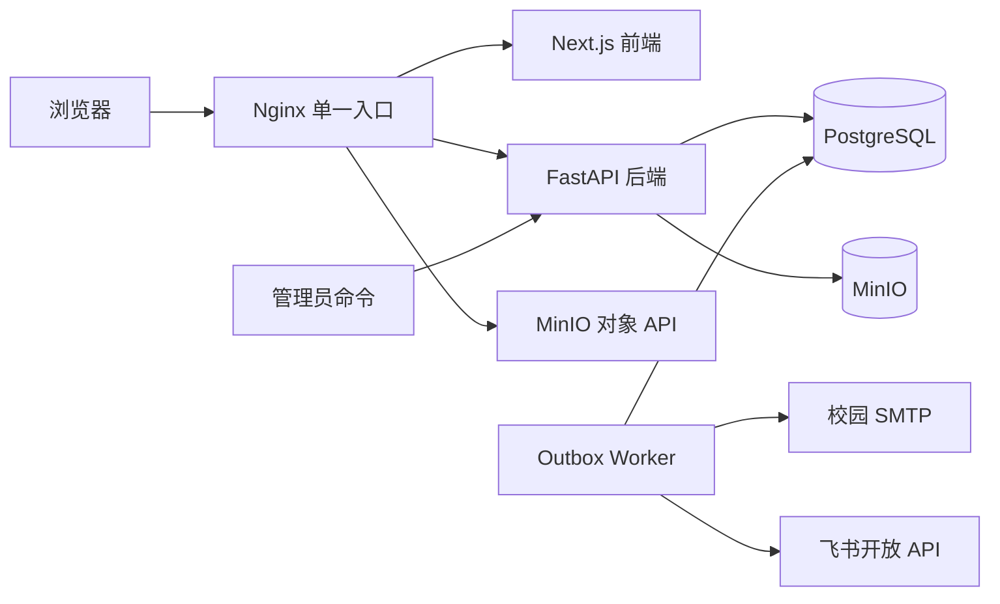

# 项目总览

## 项目定位

本项目是 HKUST(GZ) RoboMaster PNX 团队面向新生培训与校内赛的内部业务平台。它把原本分散在群消息、表单和网盘中的身份验证、信息发布、作业提交、私密反馈、赛事组队和优秀作业展示整合为可追溯流程。

系统不承担培训正文编辑或知识库写回。已有战队官网与飞书知识库继续独立维护；本平台只由管理员手动触发飞书开放 API 同步，保存最近一次成功的只读培训文档快照供登录用户阅读，不依赖现有官网运行时。知识库同步顺序、块转换和失败语义以参考仓库提交 `c28f8a0` 为兼容契约；当前阅读器布局与交互按 ADR-034 执行：右侧本文目录随页面滚动并高亮当前章节，成功打开文档后折叠系统主要导航而不改变文档目录状态；本平台继续负责登录鉴权、`AppShell`、成功快照、MinIO 资源授权、Worker 和管理员手动接口。

## 目标用户

| 用户 | 主要目标 |
| --- | --- |
| 新生/学生 | 使用学校邮箱自助注册，阅读同步的培训文档，接收通知，查看和提交作业，报名并组队参加校内赛，填写问卷，查看私密评语与作业内的优秀作业 |
| 管理员 | 管理异常账号和技术方向分类，手动同步飞书知识库，发布通知和作业，管理校内赛队伍与问卷，给出私密评语，在作业内标记优秀作业并处理审计 |

## 核心场景

1. 新生使用后缀精确为 `connect.hkust-gz.edu.cn` 的学校邮箱注册；邮箱验证成功后立即激活。空系统首个完成验证的账号成为管理员，其余账号成为学生，不要求人工审批或分组；历史数据库若只有一个已验证 active 账号，也必须保证该账号为管理员。
2. 管理员默认向全体学生发布通知；维护技术方向后，也可按方向定向发布。历史届次受众仅为兼容数据，不再提供设置入口。
3. 管理员创建培训作业并关联外部培训资料；目标学生在截止前提交文本、链接和附件，可用新版本修订。
4. 管理员对指定版本写私密评语，学生查看反馈后在允许的时间内继续提交。
5. 管理员发布唯一的当前校内赛公告，学生报名后搜索队伍、使用邀请码入队或主动申请自动分配；报名截止后队伍锁定。
6. 管理员创建包含多道单选/多选题的问卷并设置每人提交次数，学生登录后填写，管理员查看分题统计和实名最新答案名单，并可生成本地二维码。
7. 管理员把指定作业提交版本标记为优秀作业；该作业的学生在作业详情中查看优秀内容，私密评语不会随之展示。

## 系统边界

### 首版包含

- `@connect.hkust-gz.edu.cn` 学校邮箱注册、验证后直接激活、首个验证/唯一已验证账号管理员保证、登录、密码重置、管理员禁用与恢复。
- 两角色授权，以及不阻塞登录的可选技术方向管理。届次字段保留为历史兼容，不再作为可维护设置。
- 管理员可在当前 Session 临时切换为学生视图；真实角色降级由其他管理员执行时撤销全部 Session，不能由本人恢复。
- Markdown 通知、附件、定向受众、定时发布、置顶、归档、站内未读和邮件通知。
- 个人作业、多版本提交、截止时间、个人延期和私密评语。
- 校内赛公告、团队报名、队伍公开目录、邀请码、主动自动分配、队长和队伍锁定。
- 登录态多题问卷、可配置每人提交次数、本人最新答案、管理员分题统计/实名名单和本地二维码。
- 飞书知识库手动异步同步、首次上线内部前台初始化、最后成功快照、按参考提交对齐的结构化培训文档阅读和受控媒体。
- 对应作业受众可见的优秀作业区块。
- 2 GB 版本附件、MinIO 分片上传、审计、备份与健康检查设计。

### 首版不包含

- 多学校、多组织或租户隔离。
- 校园统一身份认证、OAuth、MFA 或移动 App。
- 培训课程正文编辑、知识库写回、定时同步、现有官网修改或运行时集成。
- 分数、量规、排名、公开评语、自动评奖或证书。
- 作业团队提交、赛事个人提交、即时聊天、讨论区或通用文件盘。
- 访客可见内容；除认证流程外，所有业务页面均需登录。

## 总体架构

Nginx 是用户网络唯一入口。Next.js 负责页面和浏览器交互；FastAPI 负责认证、授权与业务规则；PostgreSQL 保存结构化数据、知识块和 Outbox；MinIO 保存附件与知识库媒体；Worker 处理定时发布、邮件重试和管理员触发的飞书同步，Web/API 不直接访问飞书。

## 成功标准

- 新生能够独立完成注册、邮箱验证、登录、查看通知和提交作业，不依赖管理员逐人审批或人工收集文件。
- 管理员能明确看到未提交、已提交、版本历史、团队状态和邮件投递结果。
- 私密评语不会泄露给无关学生，非队长不能提交赛事成果。
- 任一提交版本都能关联提交人、时间、附件校验信息、评语和审计记录。
- 单服务重启不会丢失已入队的邮件或定时发布任务。

## 权威性与变更

产品行为以 `01-product-requirements.md` 为准；页面、接口与数据必须引用其中的需求编号。发生跨模块取舍时，先更新 `15-decisions.md`，再同步受影响文档和 `16-changelog.md`。
