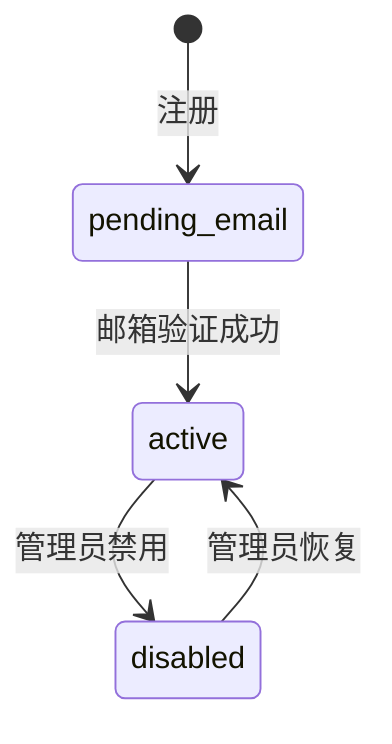
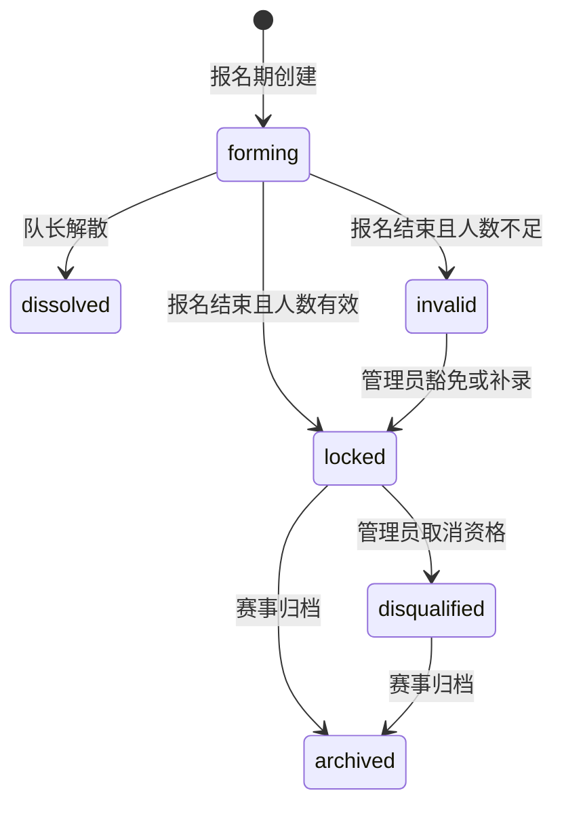

# 产品需求

## 文档约定

- “学生”指使用 `@connect.hkust-gz.edu.cn` 邮箱完成验证、处于 `active` 状态且角色为 `student` 的普通用户。
- “管理员”指角色为 `admin` 的已激活用户；空系统首个完成邮箱验证的账号自动成为初始管理员，历史数据库中唯一已验证 active 账号也必须持久化为管理员，但不形成第三种角色。
- “目标用户”指符合内容受众规则的已激活学生。技术方向是登录后可选维护的分类，不是账号激活条件；未设置方向的学生只能命中“全部学生”受众。届次设置已移除，历史届次受众仅按既有快照兼容读取。
- 所有截止时间按 `Asia/Shanghai` 向用户展示，持久化使用 PostgreSQL `TIMESTAMPTZ`。
- `必须` 表示首版验收条件；`可以` 表示首版提供的可选操作，不代表未来假设。

## 认证与账号

- **AUTH-001**：公开注册必须使用邮箱后缀精确为 `connect.hkust-gz.edu.cn` 的学校邮箱；邮箱去除首尾空白并按小写唯一比较。注册资料包括真实姓名、学号、学校邮箱和密码；密码长度必须为 8～128 个 Unicode 字符，并拒绝常见密码及与邮箱、学号高度相似的值；系统自动把规范化邮箱的 `@` 前缀派生为用户名，不提供另一套可编辑用户名。
- **AUTH-002**：注册后必须发送一次性邮箱验证链接。验证令牌只能使用一次且 24 小时过期；未验证账号状态为 `pending_email`。
- **AUTH-003**：邮箱验证成功后账号必须直接进入 `active`，不经过人工审批，也不要求先分配方向或其他组别。若系统此前不存在任何 `active` 用户，当前验证账号成为 `admin`；否则保持 `student`。后续账号激活为学生时，激活事务必须把当时仍为 `published`、未过公共截止且符合其当前受众分类的作业追加到该学生的正式受众快照。
- **AUTH-004**：只有 `active` 账号可以登录；Connect 账号可以使用派生用户名或完整邮箱，旧域名存量账号只使用完整邮箱；`pending_email` 和 `disabled` 不得创建业务 Session。
- **AUTH-005**：学生可以申请密码重置。重置令牌只能使用一次、30 分钟过期，成功重置后必须使该用户的其他 Session 失效。
- **AUTH-006**：登录创建服务端 Session；退出必须立即撤销当前 Session。用户能够查看并撤销自己的其他登录会话。
- **AUTH-007**：管理员可以禁用和恢复账号，也可以在登录后按需维护技术方向。禁用必须填写内部原因并写入审计日志；方向为空不得影响登录。历史届次字段不再提供新的维护入口。
- **AUTH-008**：空系统首个完成邮箱验证的账号必须在并发安全的事务中成为初始 `admin`；若用户表恰好只有一个账号，且该账号已验证、处于 `active student`，部署修正或其成功登录必须在相同事务锁内把它持久化为 `admin`、撤销旧 Session 并写审计。已有管理员可以将其他已验证账号提升为管理员或恢复为学生，操作必须审计；多账号但无管理员的异常历史库仍走受控恢复。容器内管理命令不是正常首次部署的必经步骤。
- **AUTH-009**：登录失败对账号不存在、密码错误和不可登录状态返回统一对外文案；系统必须先把用户名或完整邮箱规范化为账号邮箱，再按该邮箱和来源 IP 限流，并记录不含密码的安全事件。
- **AUTH-010**：邮箱、学号均全局唯一；管理员修改邮箱后，账号必须重新完成邮箱验证才能恢复登录。
- **AUTH-011**：管理员可以仅在当前 Session 开启“学生视图”。开启后 Session 的有效角色为 `student`，可访问学生工作台、通知、作业、赛事和个人提交操作；所有管理员接口必须返回 403，且前端不显示管理导航。关闭学生视图恢复当前 Session 的管理员权限；真实 `users.role` 始终不变。其他管理员把该账号真实角色改为 `student` 时必须撤销该用户全部 Session，本人重新登录后不能通过学生视图按钮恢复管理员权限。

账号状态机：

## 通知与信息发布

- **NEWS-001**：管理员可以创建包含标题、摘要、已清洗 Markdown 正文和附件的通知。
- **NEWS-002**：通知受众可以是全部学生，或选择一个或多个技术方向及其交集；未设置方向的学生只接收“全部学生”通知，发布前必须展示预计接收人数。历史届次受众继续按原规则兼容读取。
- **NEWS-003**：通知状态为 `draft`、`scheduled`、`published`、`archived`。草稿不可被学生访问；定时通知到达发布时间后由 Worker 原子发布；归档通知仍可访问但不进入默认列表。
- **NEWS-004**：管理员可以置顶已发布通知并设置置顶结束时间。学生列表先显示有效置顶项，再按发布时间倒序显示普通项。
- **NEWS-005**：通知首次发布时必须为每个目标学生建立站内通知记录。学生可以标记单条已读或全部已读，导航显示未读数量。
- **NEWS-006**：管理员可以为通知启用邮件提醒。邮件必须通过 Outbox 异步发送，站内发布成功不因 SMTP 故障回滚。
- **NEWS-007**：管理员可以编辑已发布通知，修改立即对站内生效并写入审计日志；系统默认不重复发邮件，管理员可显式执行一次“发送更新提醒”。
- **NEWS-008**：学生只能读取自己属于目标受众的通知；直接请求非目标通知必须返回 `404 RESOURCE_NOT_FOUND`，避免泄露内容存在性。

## 培训作业

- **HW-001**：管理员可以创建作业，字段包括标题、说明、外部培训资料链接、提交要求、允许的附件扩展名、发布时间、截止时间和状态。
- **HW-002**：作业受众规则与通知一致，可面向全部学生或已维护方向及其交集；未设置方向的学生只接收全体作业。发布事务生成初始受众快照；后续账号首次激活为普通学生时，只把激活时仍开放且按当时分类匹配的作业追加给该学生。此后调整方向不重算历史任务归属，作业编辑也不能改变既有快照；历史届次受众继续按原快照兼容读取。
- **HW-003**：作业状态为 `draft`、`published`、`closed`、`archived`。草稿不可见；到达截止时间后自动关闭；管理员可以提前关闭或归档。
- **HW-004**：管理员可以为单个目标学生设置个人延期时间，延期只能晚于公共截止时间。没有个人延期时默认禁止截止后提交。
- **HW-005**：管理员可以查看作业目标人数、未提交人数、已提交人数、最后提交时间和存在反馈的提交数，并按方向和提交状态过滤。
- **HW-006**：学生只能查看正式受众快照包含自己的作业；快照成员来自发布时受众和后续学生激活时的开放作业补录。管理员当前 Session 开启学生视图时，为验证学生体验可按当前方向预览已发布作业，但不改变历史受众快照；作业详情必须显示上海时区的截止时间、剩余状态、提交要求、资料链接和自己的最新提交情况。
- **HW-007**：发布后的作业可以修正文案和延期，但不得缩短到早于任何已有提交时间，也不得改变受众快照或附件规则以使历史版本失效。

## 提交版本与私密评语

- **SUB-001**：作业提交可以包含 Markdown 文本、外部链接和零个或多个附件；至少一种内容必须存在。
- **SUB-002**：每次确认提交都创建连续递增、不可变的正式版本。上传中的临时文件不构成提交版本。
- **SUB-003**：提交聚合记录必须指向最新版本，历史版本永久保留，学生和管理员都能查看版本号、提交时间和文件清单。
- **SUB-004**：学生只能在作业有效截止时间之前创建新版本；个人延期优先于公共截止时间。管理员不得伪装成学生创建版本。
- **SUB-005**：学生只能查看和修改自己的提交上下文，不能查看其他学生是否提交或其版本内容。
- **SUB-006**：管理员可以为具体版本填写或修订私密评语。作业评语只对该学生和管理员可见；每次修订必须保留审计记录。
- **SUB-007**：系统不提供分数、等级、量规、排名或公开评语字段。
- **SUB-008**：学生不能删除正式版本。管理员只能在合规删除流程中删除附件；若版本被标记为优秀作业，则必须先取消优秀标记。

## 校内赛与团队

- **COMP-001**：系统只维护一条未归档的当前校内赛；管理员首次配置校内赛公告，字段包括名称、公告说明、规则链接、报名开始/结束时间、赛事结束时间、队伍最小/最大人数和状态。已有未归档校内赛时不得再创建第二条；已归档赛事仅作为历史记录保留。
- **COMP-002**：赛事状态为 `draft`、`registration_open`、`registration_closed`、`submission_open`、`submission_closed`、`archived`。Worker 按配置时间推进状态，管理员可以提前关闭但不能让状态逆序回退。
- **COMP-003**：激活学生可以在报名期登记参赛或撤回报名。被管理员取消资格的学生不能重新报名，取消资格原因仅管理员和本人可见。
- **COMP-004**：校内赛不设置赛题、交付项或赛事作品提交；现有赛题 API 仅为历史数据兼容保留，不属于新赛事流程。
- **COMP-005**：比赛不提供分数、评委、排名、自动评奖、公开评语或作品评审。
- **COMP-006**：赛事归档后，报名和队伍均为只读；管理员仍可查看审计记录。历史赛事提交数据继续按原权限只读保留。

- **TEAM-001**：已报名学生可以在报名期创建队伍并成为队长，或使用一次输入的邀请码加入已有队伍；邀请凭证在数据库中只保存哈希。
- **TEAM-002**：同一学生在同一赛事最多属于一支未撤销队伍，由数据库唯一约束保证。
- **TEAM-003**：队长可以在报名期移除成员、轮换邀请码和转让队长。队长退出前必须转让队长；仅剩一人时可以解散队伍。
- **TEAM-004**：加入操作不得超过最大人数。报名结束时少于最小人数的队伍标记为 `invalid`，管理员可以在赛事结束前人工豁免并审计原因。
- **TEAM-005**：报名结束后队伍自动进入 `locked`，普通成员关系不可再修改；管理员可以进行带原因的补录、移除或队长变更。
- **TEAM-006**：报名结束后，`locked` 且有效的队伍作为参赛队伍只读展示；本产品不创建赛事作品版本或赛事评语。
- **TEAM-007**：重复入队返回 `409 ALREADY_IN_COMPETITION_TEAM`；历史赛事提交接口仍按兼容路径执行原有队长权限校验。
- **TEAM-008**：学生队伍中心必须提供按队伍名称搜索和分页的公开目录，只包含未满的 `forming` 队伍并只返回队伍名称、状态与人数，不公开成员身份或邀请码。报名期内已报名、尚无队伍的学生可以主动申请自动分配；服务端在事务内优先加入人数较少的未满 `forming` 队伍，无可用队伍时自动创建队伍并只在响应中返回一次邀请码，一赛一队唯一索引继续处理并发冲突。

赛事和队伍状态关系：

## 学生意向调查

- **INT-001**：管理员可以创建包含标题、已清洗 Markdown 说明和 1～30 个选项的意向调查；调查可配置为单选或多选，标题和选项去除首尾空白后不得为空或重复。
- **INT-002**：意向调查状态为 `draft`、`open`、`closed`、`archived`，只允许按该顺序推进；仅 `open` 且处于可选开始/结束时间窗口内的调查允许学生读取和填写。
- **INT-003**：登录学生可以填写当前开放调查，并在调查关闭前修改自己的选择和可选补充说明；同一学生对同一调查始终只有一份当前回答。
- **INT-004**：单选调查必须且只能提交一个有效选项，多选调查可以提交一个或多个有效选项；服务端验证所有选项属于当前调查，个人答案仅本人可读取。
- **INT-005**：管理员可以查看有效学生总数、填写人数、填写率及每个选项的人数和比例，但管理 API 和页面不得返回个人答案、姓名或学号。
- **INT-006**：管理员可以为未关闭调查生成移动端填写二维码；二维码 token 使用不可猜测随机值、数据库只保存 SHA-256，重新生成后旧 token 立即失效。二维码只定位调查，学生扫码后仍必须登录，并在登录后返回原调查填写页。

## 飞书培训知识库

- **KB-001**：登录用户可以查看最近一次成功同步的飞书培训知识库目录、同步时间和文档数量；尚无成功快照时显示明确空状态。
- **KB-002**：阅读器采用白色主题，顶部展示知识库标题、文档数和同步时间；桌面从左到右为可折叠的 280 px 文档目录、正文和正文右侧可折叠的 180 px 本文目录。右侧本文目录必须随页面滚动吸附在视口内、长目录可独立滚动，并根据阅读位置高亮当前章节。支持标题搜索、URL 查询参数选中文档及飞书内部文档跳转；成功打开或切换文档后必须折叠系统最左侧主要导航，不得自动改变文档目录自身的展开状态，加载失败时两者均保持原状态。文档目录、搜索框和目录按键必须使用系统统一控件样式。移动端继续使用右下固定目录按钮打开包含文档搜索、目录树和本文目录的全屏目录。
- **KB-003**：平台按参考提交的语义渲染段落、九级来源标题、连续无序/有序列表、引用、代码与复制、分隔线、保留颜色和 Emoji 的提示块、合并单元格表格、连续图片画廊、白板图片和安全附件；不接收或渲染飞书任意 HTML。已有安全结构中的待办块可以继续兼容显示，但不得改变参考页面的排布与交互。
- **KB-004**：真实管理员可以手动创建异步知识库同步并查看最近运行状态；同一时刻最多一个 `pending/running` 同步，管理员学生视图不得访问管理接口。首次上线可以由内部运维命令接管唯一活动运行并复用同一同步器，命令不形成第二套公开写接口；此后更新继续由管理员接口创建并交给 Worker。
- **KB-005**：学生读取永远指向最近一次 `succeeded` 快照。对齐参考同步后，目录分页/递归、任一目标 Docx 的 blocks 或标题读取失败必须使整次运行失败，不能以跳过目录子树或单篇正文的方式发布部分新快照；图片或白板单项失败跳过对应块，附件失败保留整篇飞书原文回退。同步失败、Worker 重启或媒体本地化失败不得覆盖已有成功快照。
- **KB-006**：知识块存 PostgreSQL JSONB；图片、白板和安全附件存 MinIO，对象键只由服务端生成，文件内容不得写入 PostgreSQL。
- **KB-007**：知识库目录、文档和媒体接口全部要求登录；媒体下载必须确认资源被当前成功快照引用后返回短时签名地址。
- **KB-008**：部署方只需填写 `FEISHU_APP_ID`、`FEISHU_APP_SECRET`（或 secret file）和 `FEISHU_WIKI_URL`；Worker 或首次上线内部运维命令从受信 Wiki URL 解析整个空间或单篇文档目标，只访问固定飞书 API HTTPS 主机，外链只允许安全协议。参考仓库的可选 `FEISHU_DOCUMENT_ID`、硬编码租户域名和公开静态 token 文件名不得引入；危险、超限或下载失败附件只提供整篇飞书原文回退，不泄露令牌、对象键或飞书错误正文。

## 优秀作业

- **SHOW-001**：管理员可以把一个不可变的作业提交版本标记为优秀作业；赛事提交版本不得标记。
- **SHOW-002**：优秀作业只出现在对应作业详情的“优秀作业”区块，不建立独立列表、详情导航或跨作业展示；只有该作业受众和管理员可见。管理员当前 Session 开启学生视图时，按学生视图的受众预览规则读取。
- **SHOW-003**：优秀作业直接引用源提交版本，不复制文本或附件；标记存在期间，源版本和附件禁止删除。
- **SHOW-004**：管理员可以取消优秀标记；取消后立即从作业详情隐藏，源提交和审计记录保持不变。
- **SHOW-005**：优秀作业展示提交者姓名、该版本的 Markdown 文本、外部链接和附件，但永远不展示私密评语、内部审计或其他版本内容。

## 文件、上传与下载

- **FILE-001**：每个正式提交版本的全部附件合计不得超过 2 GiB；管理员可为单个作业或赛题配置更小限制，不得超过全局上限。
- **FILE-002**：大文件必须使用 MinIO 预签名分片上传，支持断点续传、进度显示、失败重试和显式终止。
- **FILE-003**：对象键由服务端生成，文件内容只存入 MinIO；PostgreSQL 只保存名称、大小、媒体类型、SHA-256、对象键、状态和引用关系。
- **FILE-004**：完成上传时必须校验声明大小、实际对象大小、扩展名、允许类型和 SHA-256；失败对象进入 `rejected`，不能关联提交版本。
- **FILE-005**：附件下载必须先通过业务授权，再返回短时预签名地址；学生不能通过猜测对象键绕过权限。
- **FILE-006**：上传会话 24 小时无活动后过期。未关联正式版本的已完成对象保留 24 小时后由 Worker 清理；引用中的对象不得自动清理。
- **FILE-007**：默认禁止可执行文件和可主动执行的 HTML/SVG；每项任务的扩展名白名单只能在全局安全白名单内收窄。

## 邮件与异步任务

- **MAIL-001**：系统通过 SMTP 发送邮箱验证、密码重置、通知提醒和提交延期提醒；不发送注册审批邮件，私密评语默认只生成站内通知且不在邮件中包含正文。
- **MAIL-002**：需要可靠执行的邮件和定时发布任务必须先与业务事务一起写入 PostgreSQL Outbox，再由独立 Worker 领取。
- **MAIL-003**：Worker 使用带锁领取和指数退避，最多尝试 8 次；最终失败进入 `dead`，管理员可以查看原因并人工重试。
- **MAIL-004**：邮件中不得包含密码、Session、私密评语、对象存储地址或永久访问令牌；验证和重置链接只能携带一次性随机令牌。
- **MAIL-005**：同一业务事件必须使用唯一幂等键，Worker 重启或重复领取不得发送重复通知。

## 非功能需求

- **NFR-001**：系统为单租户校内部署，所有用户流量只能通过 Nginx 的 80/443 端口进入；生产环境强制 HTTPS。
- **NFR-002**：除认证页面外，所有页面和 API 必须登录；所有权限判断由后端执行。
- **NFR-003**：在 300 个激活账号、100 个并发浏览会话、20 个并发分片上传的基准下，非上传 API 的服务器端 P95 响应时间应小于 500 ms。
- **NFR-004**：桌面支持 1280–1440 px 内容布局，平板和手机可完成注册、阅读、提交与组队；交互满足键盘操作、可见焦点和 WCAG 2.1 AA 对比度。
- **NFR-005**：所有时间存为 `TIMESTAMPTZ`，API 使用带时区 ISO 8601，界面默认显示 `Asia/Shanghai`。
- **NFR-006**：关键写操作必须生成包含操作者、动作、目标、结果、请求 ID、IP、时间和差异摘要的审计记录，禁止记录秘密和完整附件内容。
- **NFR-007**：PostgreSQL 和 MinIO 每日增量备份、每周完整备份；恢复演练至少每学期一次，目标 RPO 24 小时、RTO 4 小时。
- **NFR-008**：前端、后端、Worker、PostgreSQL 和 MinIO必须提供健康检查；服务重启不得丢失 Session 以外的业务数据或 Outbox 任务。
- **NFR-009**：数据库结构只能通过 Alembic 迁移演进；生产迁移必须先备份并提供回滚或前滚恢复方案。
- **NFR-010**：支持当前和前一个主要版本的 Chrome、Edge、Firefox 与 Safari；不保证旧版 IE。
- **NFR-011**：Markdown 渲染必须禁用原始 HTML或在服务端严格清洗，禁止 `script`、`iframe`、`object`、`embed`、事件属性和危险 URL 协议。
- **NFR-012**：密钥、数据库密码、SMTP 凭证和 MinIO 密钥仅从部署环境或密钥文件注入，不得进入仓库、日志或前端包。

## 权限矩阵

| 操作 | 未登录 | 学生 | 管理员 |
| --- | ---: | ---: | ---: |
| 注册、验证、登录、重置密码 | 允许 | 允许 | 允许 |
| 查看目标通知和站内提醒 | 禁止 | 仅本人受众 | 全部 |
| 查看作业 | 禁止 | 仅本人受众 | 全部 |
| 创建作业版本 | 禁止 | 仅本人且未截止 | 禁止代交 |
| 查看作业评语 | 禁止 | 仅本人 | 全部 |
| 报名、建队、加入或自动分配队伍 | 禁止 | 仅开放赛事且本人符合资格 | 管理与纠错 |
| 创建赛事版本 | 禁止 | 仅有效队长 | 禁止代交 |
| 查看赛事版本与评语 | 禁止 | 当前团队成员 | 全部 |
| 查看优秀作业 | 禁止 | 仅所属受众的作业内 | 全部作业 |
| 填写或修改意向调查 | 禁止 | 仅开放调查且仅本人 | 可在学生视图填写本人答案 |
| 查看意向汇总、管理调查与二维码 | 禁止 | 禁止 | 允许 |
| 查看培训知识库快照 | 禁止 | 允许 | 允许 |
| 手动同步和查看知识库运行状态 | 禁止 | 禁止 | 仅真实管理员视图 |
| 管理用户、通知、作业、赛事、优秀标记 | 禁止 | 禁止 | 允许 |

## 需求追溯入口

页面映射见 `04-page-specifications.md`，接口映射见 `06-api-specification.md`，数据实体映射见 `07-database-schema.md`，测试场景映射见 `11-testing-strategy.md`。

### 集中追溯矩阵

| 需求 | 页面 | API | 数据实体/约束 | 验收场景 |
| --- | --- | --- | --- | --- |
| AUTH-001～AUTH-011 | 注册、邮箱验证、登录、管理员用户、个人 Session | `/auth/*`、`/admin/users/*` | `users`、`sessions`、`one_time_tokens`、`auth_security_events`、技术方向（届次历史兼容）、审计 | AUTH-T01～AUTH-T14、SEC-T01、SEC-T03 |
| NEWS-001～NEWS-008 | 学生工作台、通知列表/详情、管理员通知 | `/announcements*`、`/admin/announcements*`、`/notifications*` | `announcements`、通知受众关联、`announcement_files`、`student_notifications`、Outbox | NEWS-T01～NEWS-T07 |
| HW-001～HW-007 | 作业列表/详情、个人版本、管理员作业/提交 | `/assignments*`、`/admin/assignments*` | `assignments`、受众配置、`assignment_audience_users`、`assignment_extensions` | HW-T01～HW-T14 |
| SUB-001～SUB-008 | 作业版本、管理员提交反馈 | `/submission-versions`、`/submissions/*`、管理员反馈接口 | `submissions`、`submission_versions`、`version_files`、`feedback` | HW-T04～HW-T09、HW-T13 |
| COMP-001～COMP-006 | 校内赛公告/报名、管理员赛事 | `/competitions*`、`/admin/competitions*` | `competitions`、`competition_registrations`（`competition_tasks` 仅兼容历史数据） | COMP-T01～COMP-T04 |
| TEAM-001～TEAM-008 | 校内赛队伍中心、我的队伍、管理员队伍 | `/teams*`、`/competitions/*/teams`、`/competitions/*/auto-assign`、`/admin/teams*` | `teams`、`team_members`、报名表与一赛一队部分唯一索引 | TEAM-T01～TEAM-T10 |
| INT-001～INT-006 | 学生意向列表/填写、管理员意向管理/统计/二维码 | `/intentions*`、`/admin/intentions*` | `intention_surveys`、`intention_options`、`intention_responses`、`intention_response_options` | INT-T01～INT-T08 |
| KB-001～KB-008 | 培训文档阅读器、管理员同步页 | `/knowledge*`、`/admin/knowledge*` | `knowledge_sync_runs`、节点、文档、媒体及引用表、`outbox_jobs` | KB-T01～KB-T12 |
| SHOW-001～SHOW-005 | 作业详情的优秀作业区块、管理员提交详情 | `/assignments/*/excellent-submissions*`、管理员标记接口 | `assignment_excellent_submissions`、作业/版本外键和删除保护 | SHOW-T01～SHOW-T05 |
| FILE-001～FILE-007 | 作业/赛题上传器、通知附件、授权下载 | `/uploads*`、`/files/*/download-url` | `files`、`upload_sessions`、`upload_parts`、正式资源附件关联 | FILE-T01～FILE-T09 |
| MAIL-001～MAIL-005 | 认证邮件提示、通知发布结果、管理员邮件任务 | 认证邮件触发接口、通知发布、`/admin/mail-outbox*` | `outbox_jobs`、`student_notifications`、唯一事件键 | MAIL-T01～MAIL-T04、NEWS-T03 |
| NFR-001～NFR-012 | 全局布局、认证守卫、响应式/无障碍、错误与健康状态 | 同源 `/api/v1`、健康接口、所有受保护端点 | 审计、Session、约束、迁移、备份与服务配置 | NFR-T01～NFR-T12、性能与恢复演练 |
