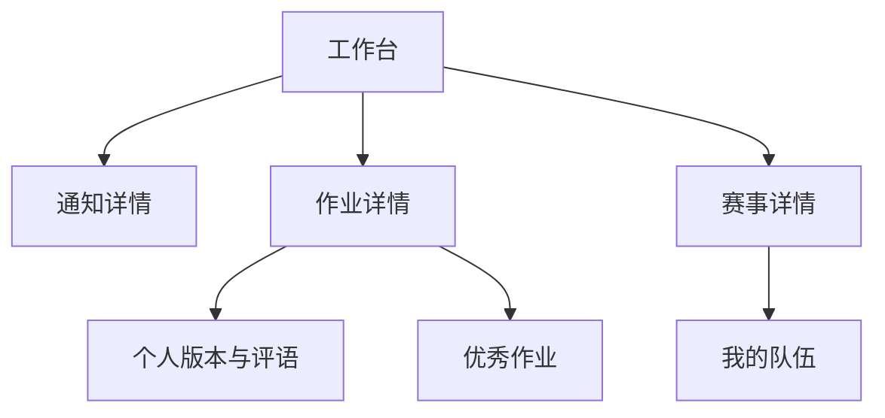

# 信息架构

## 架构原则

- 认证入口与业务工作台分离；业务内容不允许未登录预览。
- 学生导航围绕“现在需要做什么”组织，管理员导航围绕“需要处理什么”组织。
- 通知、作业和赛事是三个一级业务域；提交版本属于作业或赛事上下文，不作为全站公共内容。
- 技术方向是登录后可选维护的受众与过滤维度，不是激活账号的前置条件或独立内容门户；届次设置已移除，历史字段只作兼容。
- 优秀作业属于具体作业，只在该作业详情中展示，不作为一级内容域。
- 现有培训站只作为作业中的外部资料 URL，不加入本系统全局导航。

## 路由树

```text
/
├── /login
├── /register
├── /verify-email
├── /forgot-password
├── /reset-password
├── /dashboard
├── /announcements
│   └── /announcements/[announcementId]
├── /assignments
│   └── /assignments/[assignmentId]
│       ├── /assignments/[assignmentId]/submissions/[submissionId]
│       └── /assignments/[assignmentId]/excellent-submissions/[versionId]
├── /competitions
│   └── /competitions/[competitionId]
│       ├── /competitions/[competitionId]/team
│       └── 旧赛题路径重定向回赛事详情
├── /profile
│   └── /profile/sessions
└── /admin
    ├── /admin/dashboard
    ├── /admin/users
    ├── /admin/categories（方向设置）
    ├── /admin/announcements
    │   ├── /admin/announcements/new
    │   └── /admin/announcements/[announcementId]
    ├── /admin/assignments
    │   ├── /admin/assignments/new
    │   └── /admin/assignments/[assignmentId]
    ├── /admin/submissions/[submissionId]
    ├── /admin/competitions（当前校内赛与队伍）
    │   ├── /admin/competitions/new（仅首次配置且无当前赛事时）
    │   ├── /admin/competitions/[competitionId]
    │   └── /admin/competitions/[competitionId]/teams/[teamId]
    ├── /admin/mail
    └── /admin/audit
```

根路径 `/` 根据状态跳转：未登录跳转 `/login`，已登录学生跳转 `/dashboard`，已登录且有效角色为管理员的 Session 跳转 `/admin/dashboard`；管理员学生视图按学生有效角色跳转 `/dashboard`。`pending_email` 用户只能访问邮箱验证、重新发送验证和登录提示页面。

## 学生全局布局

### 桌面顶部导航

1. PNX 标识与“Training Hub”产品名。
2. 工作台。
3. 通知。
4. 作业。
5. 校内赛。
6. 右侧未读通知入口、用户菜单与退出。

顶部导航保持一层，不加入培训资料、版本历史等二级入口。当前位置通过红色底线和 `aria-current="page"` 标识。

### 移动端导航

底部固定导航包含工作台、通知、作业、赛事和“更多”。个人资料、会话与退出放入“更多”抽屉。抽屉打开时锁定背景滚动并正确管理焦点。

## 管理员全局布局

桌面使用左侧栏，依次包含概览、用户、方向设置、通知、作业、校内赛、邮件任务和审计日志。校内赛入口直接展示当前未归档校内赛及队伍，不提供多赛事创建。管理员真实角色保持 `admin`，可通过侧栏底部“查看学生视图”切换当前 Session 的有效角色；学生视图隐藏管理入口，但后端仍独立鉴权，真实角色不会改变。

移动端管理员页面使用可折叠抽屉；数据表切换为卡片或水平滚动，关键管理操作不隐藏在仅鼠标可发现的交互中。

## 内容层级



## 主要用户流

### 注册与邮箱验证

`使用 @connect.hkust-gz.edu.cn 邮箱注册 → 邮件验证并直接激活 → 登录`。空系统首个完成验证的账号进入管理后台并可配置人员角色，其余账号进入学生工作台；不做人工审批或强制初始分组。

### 作业提交

`工作台待办 → 作业详情 → 填写文本/链接 → 分片上传附件 → 核对清单 → 确认正式提交 → 查看版本历史 → 查看私密评语 → 截止前提交新版本`。

### 赛事公告与组队

`赛事列表 → 阅读校内赛公告 → 报名 → 创建队伍或输入邀请码 → 队伍成形 → 报名结束自动锁定`。

### 优秀作业标记

`管理员查看作业提交版本 → 标记为优秀作业 → 对应作业详情显示 → 作业受众查看 → 必要时取消标记`。赛事提交不进入该流程。

## 搜索与过滤

- 通知、作业和赛事列表支持标题关键词搜索；优秀作业仅在作业内浏览，不提供跨作业搜索。
- 学生列表默认按“与我相关”过滤，不显示不可访问内容。
- 管理员列表支持状态、方向、日期范围和提交状态过滤；过滤条件进入 URL 查询参数，便于刷新和分享内部链接。
- 首版不实现跨域全站搜索，避免将私密提交错误纳入公共索引。

## 面包屑与返回规则

- 详情页显示最多三级面包屑，例如“作业 / 电控第一次作业 / 版本记录”。
- 创建和编辑表单取消时返回来源列表，并保留筛选参数。
- 提交成功后进入该提交的版本详情，不返回空表单。

## 空状态与错误导航

- 无内容：解释当前没有可见项目，并只展示用户有权限执行的操作。
- 403：提示无操作权限，不显示受保护资源标题或摘要。
- 404：不可见资源与不存在资源使用同一页面。
- 410：过期验证或重置链接提供重新申请入口。
- 429：显示可重试时间，不自动高频重试。
- 5xx：显示请求 ID和重试入口；已填写表单内容保留在浏览器内存，不持久化密码。

## 路由与需求映射

| 路由组 | 主要需求 |
| --- | --- |
| 注册、验证与账号管理 | AUTH-001～AUTH-011 |
| 工作台、通知 | NEWS-001～NEWS-008、MAIL-001 |
| 作业、个人提交 | HW-001～HW-007、SUB-001～SUB-008、FILE-001～FILE-007 |
| 赛事、队伍 | COMP-001～COMP-006、TEAM-001～TEAM-005 |
| 作业内优秀作业 | SHOW-001～SHOW-005 |
| 管理后台 | AUTH-007～AUTH-008、NEWS-001～NEWS-007、HW-001～HW-007、COMP-001～COMP-006、MAIL-002～MAIL-005、NFR-006 |
