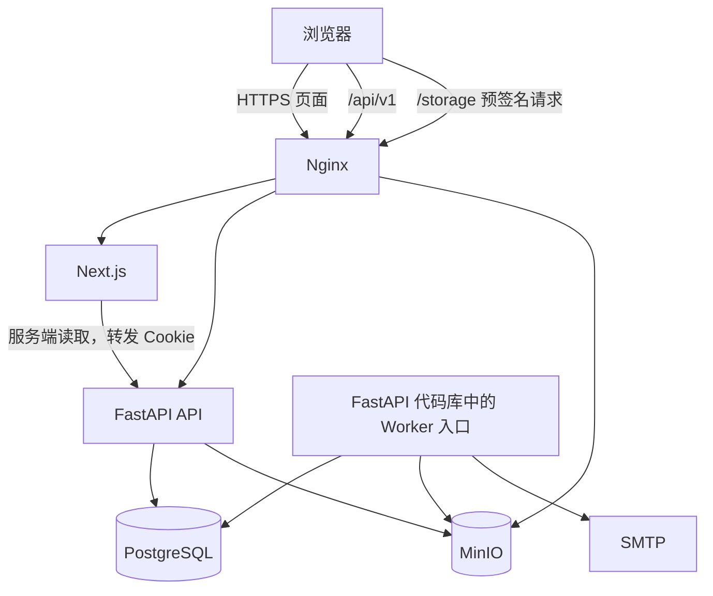
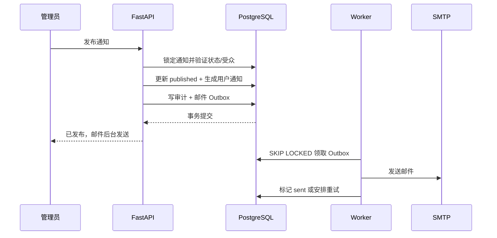

# 系统架构

## 架构目标

在单台或小规模校内服务器上，以最少服务实现清晰的权限边界、可靠邮件、2 GiB 分片上传和可恢复部署。系统采用模块化单体后端，不按业务域拆微服务；前后端和对象存储通过 Nginx 同源访问。

## 单仓库结构

```text
homework_system/
├── frontend/
│   ├── app/
│   ├── components/
│   ├── features/
│   ├── lib/
│   ├── styles/
│   └── tests/
├── backend/
│   ├── app/
│   │   ├── api/
│   │   ├── auth/
│   │   ├── users/
│   │   ├── announcements/
│   │   ├── assignments/
│   │   ├── competitions/
│   │   ├── submissions/
│   │   ├── uploads/
│   │   ├── notifications/
│   │   ├── audit/
│   │   ├── database/
│   │   └── core/
│   ├── migrations/
│   └── tests/
├── infra/
│   ├── nginx/
│   ├── compose/
│   ├── backup/
│   └── scripts/
├── README.md
├── AGENTS.md
└── .agents/
```

业务模块只按真实职责拆分。共享权限、事务、错误、时间和配置放在 `core`；不能建立只转发调用的包装层。

## 运行组件



| 组件 | 职责 | 不得承担 |
| --- | --- | --- |
| Nginx | TLS、同源路由、请求大小和超时、基础安全头 | 业务鉴权、数据库访问 |
| Next.js | 页面渲染、表单、状态呈现、分片上传编排 | 权限最终判断、业务数据持久化 |
| FastAPI | API、Session、授权、事务、业务规则、预签名 | 代理整个 2 GiB 文件、渲染前端页面 |
| Worker | Outbox、定时状态推进、邮件、过期上传清理 | 接受用户流量 |
| PostgreSQL | 元数据、约束、事务、Session、Outbox、审计 | 附件二进制内容 |
| MinIO | 附件分片与对象持久化 | 用户、权限和业务状态 |

## 前端架构

- 使用 Next.js App Router、TypeScript 严格模式和 Tailwind CSS。
- 页面与只读详情默认使用 Server Component；表单、筛选、未读状态、队伍交互和上传器使用 Client Component。
- 浏览器统一调用同源 `/api/v1`；服务端渲染时由封装的 API Client 显式转发请求 Cookie 和请求 ID。
- 外部 API 响应在边界使用 schema 验证，域组件只接收已验证类型。
- 服务端数据依赖 Next.js 缓存标签；写操作成功后按资源标签失效。认证、提交版本和管理后台读取默认不使用跨用户共享缓存。
- 表单状态局部维护；不引入全局客户端状态库，除非后续出现多个远距离页面共享且无法由 URL/服务端状态表达的真实需求。
- Markdown 使用禁用原始 HTML 的统一渲染器；管理员预览与学生详情共用配置。
- 分片上传器负责切片、有限并发、重试和恢复，文件不经过 Next.js Server Action。

## 后端分层

```text
API Router
  ↓ 协议解析、依赖注入、响应映射
Service
  ↓ 业务规则、授权、状态机、事务边界
Repository
  ↓ 持久化查询和锁策略
PostgreSQL / MinIO / SMTP Adapter
```

- Router 不直接调用 ORM，不处理跨资源权限。
- 登录标识在认证 Service 入口规范化：不含 `@` 的值补全当前 Connect 域名，完整邮箱保留其域名并统一小写；Repository 始终只按规范化完整邮箱查询，不持久化独立用户名。
- Service 在一个显式事务中完成业务写入、审计和 Outbox 入队。
- Repository 不决定“谁能做什么”，只实现具名查询和持久化。
- `AuthenticatedContext` 同时保留真实用户角色与当前 Session 的有效角色。管理员开启学生视图只写 `sessions.student_view`；学生业务按有效角色授权，`AdminContextDependency` 必须要求真实 `admin` 且未开启学生视图。角色服务把账号降为学生时在同一事务撤销全部 Session，临时视图不能绕过真实降级。
- ORM 模型不直接作为 API 响应；Pydantic 请求/响应模型与数据库模型分离。
- 所有时间从可注入时钟获取，便于测试截止和定时状态推进。
- 对队伍加入、提交版本号、发布和 Outbox 领取使用数据库约束与行锁，不能只依赖前端禁用按钮。

## 领域模块

| 模块 | 核心职责 | 主要需求 |
| --- | --- | --- |
| `auth` | 密码、Session、一次性令牌、CSRF、限流 | AUTH-001～AUTH-011 |
| `users` | 邮箱验证后激活、角色、技术方向、禁用状态；届次字段仅历史兼容 | AUTH-003、AUTH-007～AUTH-010 |
| `announcements` | 受众、发布、置顶、归档 | NEWS-001～NEWS-008 |
| `assignments` | 个人任务、受众快照、截止、延期和优秀作业标记 | HW-001～HW-007、SHOW-001～SHOW-005 |
| `competitions` | 校内赛公告、阶段、报名与队伍 | COMP-001～COMP-006、TEAM-001～TEAM-005 |
| `submissions` | 两类提交的聚合、不可变版本和私密评语 | SUB-001～SUB-008 |
| `uploads` | 分片会话、对象校验、下载授权、清理 | FILE-001～FILE-007 |
| `notifications` | 站内通知、已读、Outbox 和邮件 | NEWS-005～NEWS-006、MAIL-001～MAIL-005 |
| `audit` | 关键写操作差异与安全事件 | NFR-006 |

## 写入事务模式

以“发布通知”为例：



业务结果和 Outbox 在同一事务中提交，SMTP 调用不占用用户请求事务。

## 提交流程

1. 客户端创建上传会话，服务端校验作业、身份、截止和剩余大小；赛事上传仅服务历史兼容路径。
2. 服务端创建 MinIO multipart upload，返回服务端会话 ID。
3. 客户端按需请求预签名分片 URL，通过 Nginx 直传 MinIO。
4. 客户端提交分片 ETag 和整体 SHA-256，服务端完成 multipart 并校验对象。
5. 全部附件状态为 `available` 后，客户端确认正式提交。
6. Service 锁定提交聚合，计算下一个版本号，创建不可变版本和附件引用，更新最新版本指针并审计。

正式提交事务不调用 MinIO 大文件传输，只引用已验证对象。

## 一致性与并发

- 邮箱、学号、同赛事队伍成员、版本号和幂等键使用数据库唯一约束；首个验证账号授予与唯一已验证账号修正共用固定 PostgreSQL 事务级 advisory lock，后者重新锁定用户行并确认不存在其他账号后才提升角色、撤销旧 Session 和写审计。
- 加入队伍时锁定报名和目标队伍；同时依赖唯一约束处理并发双加入。
- 创建版本时锁定提交聚合；客户端幂等键保证网络重试不产生两个版本。
- 发布、归档、提前关闭和队伍锁定使用条件更新，状态不匹配返回 409。
- MinIO 与 PostgreSQL 不能跨系统事务；对象先完成校验再入版本，孤立对象由 Worker 延迟清理。

## 配置

配置按环境注入并在启动时验证，包括应用 URL、数据库 DSN、MinIO 内外部端点、桶名、Session 密钥、CSRF 配置、校园邮箱域名、SMTP、全局上传限制、时区、日志级别和备份目录。缺少生产必需项时服务必须启动失败，不能使用弱默认秘密。

## 可观测性

- 每个入口请求生成或接受合法 `X-Request-ID`，传递到响应、日志、审计和 Outbox。
- 日志为结构化 JSON，包含时间、级别、服务、请求 ID、用户 ID、路径模板、状态码和耗时。
- 指标至少包括 API 延迟/错误、活跃 Session、上传会话、Outbox 积压/最终失败、对象存储容量和备份状态。
- 健康端点区分存活与就绪；就绪检查数据库和必要配置，不因 SMTP 暂时不可用将 API 判为不健康。

## 扩展边界

首版以单实例 API 和单 Worker 为默认，但数据库锁与幂等设计允许后续水平扩展。不得提前拆微服务或引入消息队列；当真实负载证明 PostgreSQL Outbox 不足时，才通过 ADR 评估替换。
