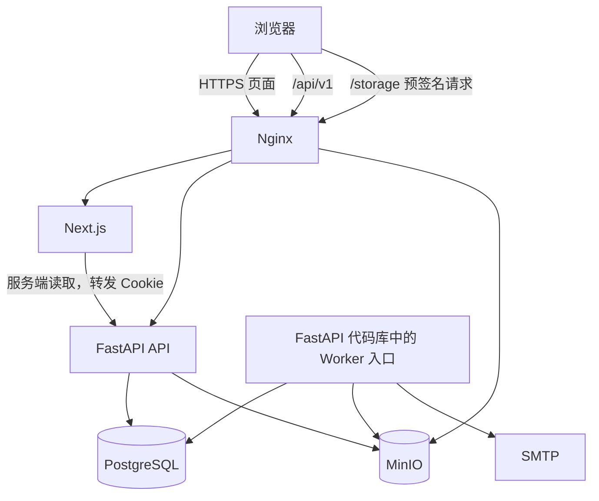
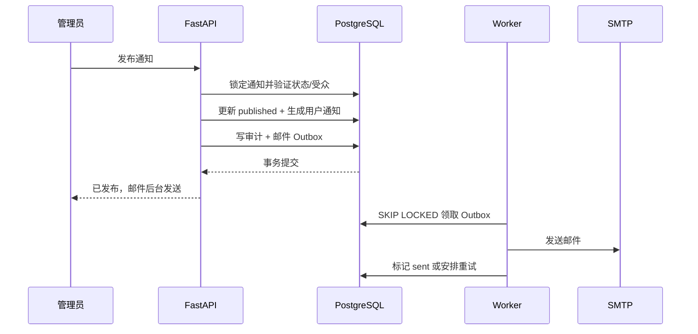

# 系统架构

## 架构目标

在单台或小规模校内服务器上，以最少服务实现清晰的权限边界、可靠邮件、2 GiB 分片上传和可恢复部署。系统采用模块化单体后端，不按业务域拆微服务；前后端和对象存储通过 Nginx 同源访问。

## 单仓库结构

```text
homework_system/
├── frontend/
│   ├── app/
│   ├── components/
│   ├── features/
│   ├── lib/
│   ├── styles/
│   └── tests/
├── backend/
│   ├── app/
│   │   ├── api/
│   │   ├── auth/
│   │   ├── users/
│   │   ├── announcements/
│   │   ├── assignments/
│   │   ├── competitions/
│   │   ├── help_requests/
│   │   ├── submissions/
│   │   ├── uploads/
│   │   ├── notifications/
│   │   ├── audit/
│   │   ├── database/
│   │   └── core/
│   ├── migrations/
│   └── tests/
├── infra/
│   ├── nginx/
│   ├── compose/
│   ├── backup/
│   └── scripts/
├── README.md
├── AGENTS.md
└── .agents/
```

业务模块只按真实职责拆分。共享权限、事务、错误、时间和配置放在 `core`；不能建立只转发调用的包装层。

## 运行组件



| 组件 | 职责 | 不得承担 |
| --- | --- | --- |
| Nginx | TLS、同源路由、请求大小和超时、基础安全头 | 业务鉴权、数据库访问 |
| Next.js | 页面渲染、表单、状态呈现、分片上传编排 | 权限最终判断、业务数据持久化 |
| FastAPI | API、Session、授权、事务、业务规则、预签名 | 代理整个 2 GiB 文件、渲染前端页面 |
| Worker | Outbox、定时状态推进、邮件、过期上传清理 | 接受用户流量 |
| PostgreSQL | 元数据、约束、事务、Session、Outbox、审计 | 附件二进制内容 |
| MinIO | 附件分片与对象持久化 | 用户、权限和业务状态 |

## 前端架构

- 使用 Next.js App Router、TypeScript 严格模式和 Tailwind CSS。
- 页面与只读详情默认使用 Server Component；表单、筛选、未读状态、队伍交互、反馈答疑处理和上传器使用 Client Component。
- 浏览器统一调用同源 `/api/v1`；服务端渲染时由封装的 API Client 显式转发请求 Cookie 和请求 ID。
- 外部 API 响应在边界使用 schema 验证，域组件只接收已验证类型。
- 服务端数据依赖 Next.js 缓存标签；写操作成功后按资源标签失效。认证、提交版本和管理后台读取默认不使用跨用户共享缓存。
- 表单状态局部维护；不引入全局客户端状态库，除非后续出现多个远距离页面共享且无法由 URL/服务端状态表达的真实需求。
- Markdown 使用禁用原始 HTML 的统一渲染器；管理员预览与学生详情共用配置。问卷二维码使用浏览器端 `qrcode` 从服务端短时返回的填写 URL 本地生成，不调用第三方二维码服务；实名名单只在管理页面当前内存展示，不进入持久化前端状态。
- 分片上传器负责切片、有限并发、重试和恢复，文件不经过 Next.js Server Action。

## 后端分层

```text
API Router
  ↓ 协议解析、依赖注入、响应映射
Service
  ↓ 业务规则、授权、状态机、事务边界
Repository
  ↓ 持久化查询和锁策略
PostgreSQL / MinIO / SMTP Adapter
```

- Router 不直接调用 ORM，不处理跨资源权限。
- 登录标识在认证 Service 入口规范化：不含 `@` 的值补全当前 Connect 域名，完整邮箱保留其域名并统一小写；Repository 始终只按规范化完整邮箱查询，不持久化独立用户名。
- 登录 Service 在应用层失败计数前查询账号并执行真实或 dummy Argon2id 校验；正确密码且账号为 `active` 时直接进入 Session 事务，只有不存在、密码错误或不可登录状态才读取并追加 10 分钟窗口内的失败事件。注册、验证邮件重发和密码重置申请只追加安全分析事件，不查询历史事件形成应用层持久等待。Nginx 仍在 Service 外执行瞬时来源 IP 粗限流。
- Service 在一个显式事务中完成业务写入、审计和 Outbox 入队。
- Repository 不决定“谁能做什么”，只实现具名查询和持久化。
- `AuthenticatedContext` 同时保留真实用户角色与当前 Session 的有效角色。管理员开启学生视图只写 `sessions.student_view`；学生业务按有效角色授权，`AdminContextDependency` 必须要求真实 `admin` 且未开启学生视图。角色服务把账号降为学生时在同一事务撤销全部 Session，临时视图不能绕过真实降级。
- ORM 模型不直接作为 API 响应；Pydantic 请求/响应模型与数据库模型分离。
- 所有时间从可注入时钟获取，便于测试截止和定时状态推进。
- 对队伍加入、自动分配、问卷回答/提交次数、提交版本号、发布和 Outbox 领取使用数据库约束与行锁，不能只依赖前端禁用按钮。

## 领域模块

| 模块 | 核心职责 | 主要需求 |
| --- | --- | --- |
| `auth` | 密码、Session、一次性令牌、CSRF、限流与本人注销路由 | AUTH-001～AUTH-012 |
| `users` | 邮箱验证后激活、角色、技术方向、禁用状态、账号擦除编排和队长/个人数据清理；后续学生激活事务补录开放作业受众，届次字段仅历史兼容 | AUTH-003、AUTH-007～AUTH-012 |
| `announcements` | 受众、发布、置顶、归档与管理员删除 | NEWS-001～NEWS-009 |
| `assignments` | 个人任务、发布时快照与新学生激活补录、截止、延期、管理员删除和优秀作业标记 | HW-001～HW-008、SHOW-001～SHOW-005 |
| `competitions` | 校内赛公告、阶段、报名、公开队伍目录、自动分配与管理员队伍删除 | COMP-001～COMP-006、TEAM-001～TEAM-009 |
| `intentions` | 多题问卷、本人最新回答与次数上限、管理员分题统计/实名名单、二维码 token | INT-001～INT-006 |
| `help_requests` | 学生本人私密工单、已解答问题的登录态匿名公开读取、管理员处理/删除与答复通知 | HELP-001～HELP-008 |
| `submissions` | 两类提交的聚合、不可变版本和私密评语 | SUB-001～SUB-008 |
| `uploads` | 分片会话、对象校验、下载授权、清理 | FILE-001～FILE-007 |
| `notifications` | 站内通知、按目标业务分类徽标、已读、Outbox 和邮件 | NEWS-005～NEWS-006、MAIL-001～MAIL-005 |
| `audit` | 关键写操作差异与安全事件 | NFR-006 |

## 写入事务模式

以“发布通知”为例：



业务结果和 Outbox 在同一事务中提交，SMTP 调用不占用用户请求事务。

反馈答疑创建在一个事务内写工单和审计；管理员答复事务锁定工单、校验 revision、更新答复与状态，并同时写审计和站内通知。管理员删除事务锁定工单，把相关未读解决提醒标为已读，写入不含正文或身份的审计后物理删除工单。以上流程不创建邮件 Outbox，任一步失败都整体回滚。公开可见性不单独写状态：读取层只选择 `request_type=question AND status=resolved`，并使用不连接用户表的匿名响应映射。

## 账号擦除流程

1. Router 只解析管理员删除或本人注销请求，依赖层先验证有效 Session、同源、CSRF 和真实管理员边界；Service 获取与管理员生命周期共用的事务级 advisory lock。
2. Service 依序锁定目标用户的一次性令牌、Session、用户行，再锁定当前管理员账号；使用 Argon2id 重新校验当前操作者密码，规范化比较确认邮箱，并复核管理员原因/备份确认及最后一名激活管理员保护。
3. Repository 锁定目标用户关联的当前队伍、成员、上传和文件：队长转给最早加入的其他当前成员，无成员则解散；锁定队伍人数不足且无豁免时转为 `invalid`。通知附件和团队版本附件属于共享资源，其余目标用户对象属于个人清理范围。
4. 同一 PostgreSQL 事务去标识化认证安全事件和相关邮件 Outbox，写脱敏成功审计与每个个人对象的 `delete_account_object` Outbox，再物理删除用户；个人外键级联，平台/团队共享操作者外键置空。正式版本不可变触发器只在 `SET LOCAL pnx.account_erasure = 'on'` 的当前事务中、且父提交已经被级联删除时放行，普通 UPDATE/DELETE 继续拒绝。
5. 提交成功后本人响应清 Session/CSRF Cookie；管理员页面移除目标账号。Worker 领取对象任务后先幂等终止 multipart，再删除对象；成功任务清空对象键与加密上传标识，失败只保存稳定脱敏错误并按既有 8 次退避重试。

PostgreSQL 提交前不调用 MinIO，因此数据库失败时账号、引用和对象清理任务一起回滚。数据库提交后即使 Worker 暂停，对象键也已失去授权路径；恢复 Worker 后继续清理。账号及个人对象若需恢复，只能从删除前同点 PostgreSQL 与 MinIO 备份隔离恢复，不能依赖应用内撤销。

## 提交流程

1. 客户端创建上传会话，服务端校验作业、身份、截止和剩余大小；赛事上传仅服务历史兼容路径。
2. 服务端创建 MinIO multipart upload，返回服务端会话 ID。
3. 客户端按需请求预签名分片 URL，通过 Nginx 直传 MinIO。
4. 客户端提交分片 ETag 和整体 SHA-256，服务端完成 multipart 并校验对象。
5. 全部附件状态为 `available` 后，客户端确认正式提交。
6. Service 锁定提交聚合，计算下一个版本号，创建不可变版本和附件引用，更新最新版本指针并审计。

正式提交事务不调用 MinIO 大文件传输，只引用已验证对象。

## 一致性与并发

- 邮箱、学号、同赛事队伍成员、版本号和幂等键使用数据库唯一约束；首个验证账号授予与唯一已验证账号修正共用固定 PostgreSQL 事务级 advisory lock，后者重新锁定用户行并确认不存在其他账号后才提升角色、撤销旧 Session 和写审计。
- 管理员角色变更、禁用和两类账号擦除共用同一生命周期 advisory lock；删除在锁内重新统计激活管理员、锁定目标及当前操作者，不能依赖页面初始列表或前端 checkbox 作为授权事实。
- 加入队伍时锁定报名和目标队伍；自动分配锁定赛事及候选 `forming` 队伍，按人数、创建时间和 ID 稳定选择，必要时建队；两条路径都依赖一赛一队部分唯一索引处理并发双加入。
- 问卷提交先锁定问卷行再锁定本人现有回答，原子校验开放窗口和剩余提交次数，并依赖 `(survey_id, user_id)` 唯一约束处理首次提交并发；回答只保留最新选项，`submission_count` 单调增加。管理员名单批量读取回答选项，避免逐人查询；二维码轮换锁定问卷行且只持久化 token SHA-256。
- 创建版本时锁定提交聚合；客户端幂等键保证网络重试不产生两个版本。
- 发布、归档、提前关闭和队伍锁定使用条件更新，状态不匹配返回 409；公告归档事务同时锁定并标记该公告的未读站内提醒为已读。
- 通知/作业删除先锁定资源：未发布内容在同一事务删除活动定时发布 Outbox、物理删除根记录并写审计；已发布内容只转为 `archived`。学生读取从查询和详情授权两侧排除归档资源，正式提交、历史提醒与文件引用不级联删除。
- 管理员删除队伍先锁定队伍并统计 `submissions.owner_team_id` 引用：无引用时物理删除队伍和成员关联；有引用时锁定全部当前成员、写入离队时间、清空队长并转为 `dissolved`。两种路径在同一事务写脱敏审计；学生查询和常规管理员列表排除已删除队伍，团队提交、版本、评语和附件引用不级联删除。
- MinIO 与 PostgreSQL 不能跨系统事务；对象先完成校验再入版本，孤立对象由 Worker 延迟清理；账号擦除则先在数据库事务撤销引用并写具名对象清理 Outbox，绝不依据桶扫描猜测删除。

## 配置

配置按环境注入并在启动时验证，包括应用 URL、数据库 DSN、MinIO 内外部端点、桶名、Session 密钥、CSRF 配置、校园邮箱域名、SMTP、全局上传限制、时区、日志级别和备份目录。缺少生产必需项时服务必须启动失败，不能使用弱默认秘密。

## 可观测性

- 每个入口请求生成或接受合法 `X-Request-ID`，传递到响应、日志、审计和 Outbox。
- 日志为结构化 JSON，包含时间、级别、服务、请求 ID、用户 ID、路径模板、状态码和耗时。
- 指标至少包括 API 延迟/错误、活跃 Session、上传会话、Outbox 积压/最终失败、对象存储容量和备份状态。
- 健康端点区分存活与就绪；就绪检查数据库和必要配置，不因 SMTP 暂时不可用将 API 判为不健康。

## 扩展边界

首版以单实例 API 和单 Worker 为默认，但数据库锁与幂等设计允许后续水平扩展。不得提前拆微服务或引入消息队列；当真实负载证明 PostgreSQL Outbox 不足时，才通过 ADR 评估替换。

## 飞书知识库快照链路

1. 真实管理员的 `POST /admin/knowledge/sync` 在同一事务创建 `knowledge_sync_runs`、审计和唯一事件键的 `sync_knowledge` Outbox，立即返回 `202`。
2. 常规更新只有 Worker 从 Outbox 领取任务并访问固定 `https://open.feishu.cn`；首次上线可由内部前台运维命令接管唯一活动运行并复用同一同步器。Web、API 和 Next.js 始终不直接访问飞书，也不依赖现有官网运行时。
3. Worker 或内部运维命令从 `FEISHU_WIKI_URL` 的 `/wiki/space/{space_id}` 或 `/wiki/{node_token}` 路径解析整个空间或单篇文档目标。同步行为以参考仓库提交 `c28f8a0` 为契约：Wiki 目录使用 `page_size=50` 和 `page_token` 串行 DFS 先序递归，Docx 按目录顺序逐篇串行，每篇先以 `page_size=500` 分页读取 blocks，再读取文档元数据标题。
4. 每篇文档先发现普通附件和富文本内联附件，再转换结构化块；富文本 `equation.content` 保留行内公式标记，`block_type=16` 转为独立公式块。图片与附件共用请求前等待 350 ms 的串行队列，白板请求发送 `Accept: image/png`。图片或白板失败跳过对应块，附件失败保留整篇飞书原文回退。
5. 任一目录、正文或标题错误使整次运行失败；目录、全部目标文档和引用完整写入后才把运行标为 `succeeded`。读取 Service 只选择最新成功运行，失败或重试不替换旧快照。
6. 同步运行的部分唯一常量索引保证 `pending/running` 合计最多一条；事件键与可重复清空同一运行快照保证 Worker 重领幂等。

`knowledge` 域继续遵循 Router → Service → Repository；参考契约只约束同步顺序、转换语义和内容区排布，不复制公开静态运行时。ADR-041 仅补足参考提交遗漏的公式语义：前端使用本地 KaTeX 且不启用受信 HTML，不改变同步顺序或失败语义。飞书标准库 HTTPS 传输和 MinIO Adapter 可注入测试替身。飞书 app secret、tenant token、原始错误正文和对象键不进入前端、审计或业务日志。
