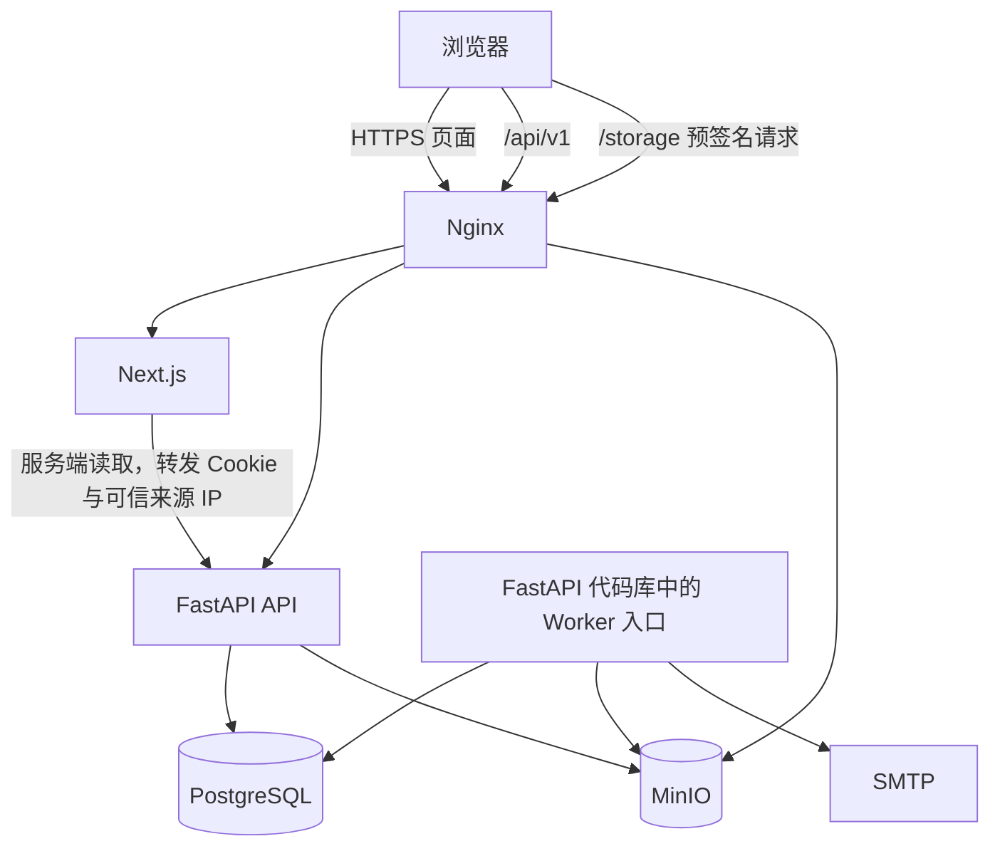
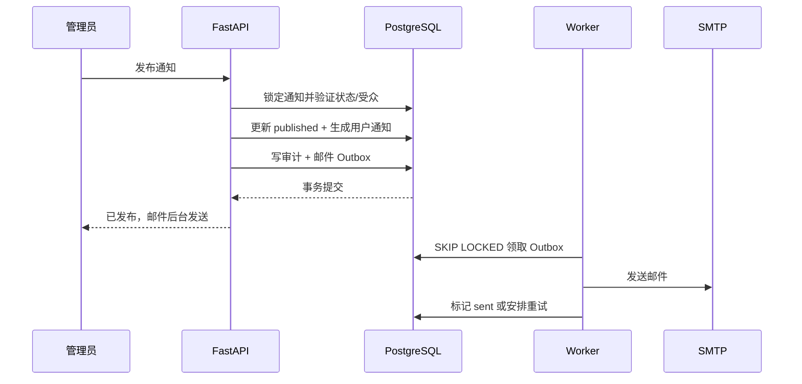

# 系统架构

## 架构目标

在单台或小规模校内服务器上，以最少服务实现清晰的权限边界、可靠邮件、2 GiB 分片上传和可恢复部署。系统采用模块化单体后端，不按业务域拆微服务；前后端和对象存储通过 Nginx 同源访问。

## 单仓库结构

```text
homework_system/
├── frontend/
│   ├── app/
│   ├── components/
│   ├── features/
│   ├── lib/
│   ├── styles/
│   └── tests/
├── backend/
│   ├── app/
│   │   ├── api/
│   │   ├── auth/
│   │   ├── users/
│   │   ├── announcements/
│   │   ├── assignments/
│   │   ├── teams/
│   │   ├── help_requests/
│   │   ├── submissions/
│   │   ├── uploads/
│   │   ├── notifications/
│   │   ├── audit/
│   │   ├── database/
│   │   └── core/
│   ├── migrations/
│   └── tests/
├── infra/
│   ├── nginx/
│   ├── compose/
│   ├── backup/
│   └── scripts/
├── README.md
├── AGENTS.md
└── .agents/
```

业务模块只按真实职责拆分。共享权限、事务、错误、时间和配置放在 `core`；不能建立只转发调用的包装层。

## 运行组件



| 组件 | 职责 | 不得承担 |
| --- | --- | --- |
| Nginx | TLS、同源路由、请求大小和超时、基础安全头 | 业务鉴权、数据库访问 |
| Next.js | 页面渲染、表单、状态呈现、分片上传编排 | 权限最终判断、业务数据持久化 |
| FastAPI | API、Session、授权、事务、业务规则、预签名 | 代理整个 2 GiB 文件、渲染前端页面 |
| Worker | Outbox、定时状态推进、邮件、过期上传清理 | 接受用户流量 |
| PostgreSQL | 元数据、约束、事务、Session、Outbox、审计 | 附件二进制内容 |
| MinIO | 附件分片与对象持久化 | 用户、权限和业务状态 |

## 前端架构

- 使用 Next.js App Router、TypeScript 严格模式和 Tailwind CSS。
- 页面与只读详情默认使用 Server Component；表单、筛选、未读状态、队伍交互、反馈答疑处理和上传器使用 Client Component。
- 浏览器统一调用同源 `/api/v1`；服务端渲染时由封装的 API Client 显式转发请求 Cookie、请求 ID 和经 Nginx 覆盖清洗的单值来源 IP，不得自行推断或伪造来源 IP。
- 外部 API 响应在边界使用 schema 验证，域组件只接收已验证类型。
- 服务端数据依赖 Next.js 缓存标签；写操作成功后按资源标签失效。认证、提交版本和管理后台读取默认不使用跨用户共享缓存。
- 表单状态局部维护；不引入全局客户端状态库，除非后续出现多个远距离页面共享且无法由 URL/服务端状态表达的真实需求。
- Markdown 使用禁用原始 HTML 的统一渲染器；管理员预览与学生详情共用配置。问卷二维码使用浏览器端 `qrcode` 从服务端短时返回的填写 URL 本地生成，不调用第三方二维码服务；实名名单只在管理页面当前内存展示，不进入持久化前端状态。
- 分片上传器负责切片、有限并发、重试和恢复，文件不经过 Next.js Server Action。作业页面可批量选择文件，但浏览器按选择顺序逐文件执行同一上传会话，避免多个大文件同时散列或上传造成资源峰值；通知上传继续保持单文件选择。

## 后端分层

```text
API Router
  ↓ 协议解析、依赖注入、响应映射
Service
  ↓ 业务规则、授权、状态机、事务边界
Repository
  ↓ 持久化查询和锁策略
PostgreSQL / MinIO / SMTP Adapter
```

- Router 不直接调用 ORM，不处理跨资源权限。
- 登录标识在认证 Service 入口规范化：不含 `@` 的值补全当前 Connect 域名，完整邮箱保留其域名并统一小写；Repository 始终只按规范化完整邮箱查询，不持久化独立用户名。
- 登录 Service 在应用层失败计数前查询账号并执行真实或 dummy Argon2id 校验；正确密码且账号为 `active` 时直接进入 Session 事务，只有不存在、密码错误或不可登录状态才读取并追加 10 分钟窗口内的失败事件。注册、验证邮件重发和密码重置申请只追加安全分析事件，不查询历史事件形成应用层持久等待。Nginx 仍在 Service 外执行瞬时来源 IP 粗限流。
- 登录 Service 只在用户显式勾选时创建 30 天持久会话，以原始高熵 Session token 为 HMAC key 绑定 Nginx 覆盖转发头后得到的精确来源 IP；数据库只存 64 位绑定摘要和既有 IP 网段展示值。认证依赖每次同时校验 Cookie、账号状态、撤销/期限和绑定摘要；IP 不参与用户查询，不能独立创建身份。
- Service 在一个显式事务中完成业务写入、审计和 Outbox 入队。
- Repository 不决定“谁能做什么”，只实现具名查询和持久化。
- `AuthenticatedContext` 同时保留真实用户角色与当前 Session 的有效角色。管理员开启学生视图只写 `sessions.student_view`；学生业务按有效角色授权，`AdminContextDependency` 必须要求真实 `admin` 且未开启学生视图。角色服务把账号降为学生时在同一事务撤销全部 Session，临时视图不能绕过真实降级。
- ORM 模型不直接作为 API 响应；Pydantic 请求/响应模型与数据库模型分离。
- 所有时间从可注入时钟获取，便于测试截止和定时状态推进。
- 对队伍加入、自动分配、问卷回答/提交次数、提交版本号、发布和 Outbox 领取使用数据库约束与行锁，不能只依赖前端禁用按钮。

## 领域模块

| 模块 | 核心职责 | 主要需求 |
| --- | --- | --- |
| `auth` | 密码、普通/持久 Session、IP 附加绑定、一次性令牌、CSRF、限流与本人注销路由 | AUTH-001～AUTH-013 |
| `users` | 邮箱验证后激活、角色、技术方向、禁用状态、账号擦除编排和队长/个人数据清理；后续学生激活事务补录开放作业受众，届次字段仅历史兼容 | AUTH-003、AUTH-007～AUTH-012 |
| `announcements` | 受众、发布、置顶、归档与管理员删除 | NEWS-001～NEWS-009 |
| `assignments` | 个人任务、发布时快照与新学生激活补录、截止、延期、管理员删除和优秀作业标记 | HW-001～HW-008、SHOW-001～SHOW-005 |
| `teams` | 全局独立队伍、邀请码、公开目录、自动分配、队长管理与管理员纠错 | TEAM-001～TEAM-009 |
| `intentions` | 多题问卷、非归档状态安全编辑与答案结构冻结、全部学生/指定技术组受众、本人最新回答与次数上限、管理员目标学生统计/实名名单、二维码 token、受众内手动成员/技术组/全部学生邮件编排、问卷物理删除，以及第一志愿到用户技术方向的显式事务编排 | INT-001～INT-010 |
| `help_requests` | 学生本人私密工单、已解答问题的登录态匿名公开读取、管理员处理/删除与答复通知 | HELP-001～HELP-008 |
| `submissions` | 个人作业提交聚合、不可变版本和私密评语；legacy 赛事列只匹配历史数据库结构 | SUB-001～SUB-008 |
| `uploads` | 分片会话、对象校验、下载授权、清理 | FILE-001～FILE-007 |
| `notifications` | 站内通知、按目标业务分类徽标、已读、Outbox 和邮件 | NEWS-005～NEWS-006、MAIL-001～MAIL-005 |
| `audit` | 关键写操作差异与安全事件 | NFR-006 |

## 写入事务模式

第一志愿方向配置由 `intentions` Service 编排：先锁定问卷并校验第一题/全量选项映射，再按稳定顺序锁定启用方向和当前 `active student` 回答者；只在方向实际变化时更新 `users.direction_id/revision`，并把逐用户方向审计与问卷级汇总审计放在同一提交中。Repository 只负责查询、锁定和持久化，Router 只转换协议。该流程不重写问卷答案或作业受众快照。
Service 在加载题目、方向和回答前先复核已锁问卷标题去除首尾空白后精确等于“意向选择”；不符合时返回稳定业务错误并回滚，前端条件渲染只用于减少误操作，不能替代该服务端边界。

问卷删除由 `intentions` Service 编排：真实管理员锁定问卷，先清理该问卷所有活动邮件 Outbox 和回答选项，再删除问卷根记录，让 0019 既有级联外键清理受众、题目、选项和回答，并在同一事务写不含正文的审计。Worker 投递问卷邮件前重新锁定其 `processing` Outbox 行；删除先提交时任务已不存在而不发送，发送先开始时删除等待投递事务完成，避免删除响应成功后再发送失效链接。

以“发布通知”为例：



业务结果和 Outbox 在同一事务中提交，SMTP 调用不占用用户请求事务。

反馈答疑创建在一个事务内写工单和审计；管理员答复事务锁定工单、校验 revision、更新答复与状态，并同时写审计和站内通知。管理员删除事务锁定工单，把相关未读解决提醒标为已读，写入不含正文或身份的审计后物理删除工单。以上流程不创建邮件 Outbox，任一步失败都整体回滚。公开可见性不单独写状态：读取层只选择 `request_type=question AND status=resolved`，并使用不连接用户表的匿名响应映射。

## 账号擦除流程

1. Router 只解析管理员删除或本人注销请求，依赖层先验证有效 Session、同源、CSRF 和真实管理员边界；Service 获取与管理员生命周期共用的事务级 advisory lock。
2. Service 依序锁定目标用户的一次性令牌、Session、用户行，再锁定当前管理员账号；使用 Argon2id 重新校验当前操作者密码，规范化比较确认邮箱，并复核管理员原因/备份确认及最后一名激活管理员保护。
3. Repository 锁定目标用户关联的当前独立队伍、成员、上传和文件：目标为队长时转给最早加入的其他当前成员，无成员则把队伍解散；不存在最低人数、锁队或人数豁免重算。通知附件和 legacy 团队版本附件属于共享资源，其余目标用户对象属于个人清理范围。
4. 同一 PostgreSQL 事务去标识化认证安全事件和相关邮件 Outbox，写脱敏成功审计与每个个人对象的 `delete_account_object` Outbox，再物理删除用户；个人外键级联，平台或 legacy 共享操作者外键置空。正式版本不可变触发器只在 `SET LOCAL pnx.account_erasure = 'on'` 的当前事务中、且父提交已经被级联删除时放行，普通 UPDATE/DELETE 继续拒绝。
5. 提交成功后本人响应清 Session/CSRF Cookie；管理员页面移除目标账号。Worker 领取对象任务后先幂等终止 multipart，再删除对象；成功任务清空对象键与加密上传标识，失败只保存稳定脱敏错误并按既有 8 次退避重试。

PostgreSQL 提交前不调用 MinIO，因此数据库失败时账号、引用和对象清理任务一起回滚。数据库提交后即使 Worker 暂停，对象键也已失去授权路径；恢复 Worker 后继续清理。账号及个人对象若需恢复，只能从删除前同点 PostgreSQL 与 MinIO 备份隔离恢复，不能依赖应用内撤销。

## 提交流程

1. 客户端创建上传会话，服务端校验作业、身份、截止和剩余大小；公共上传 Schema 与 Service 不接受赛事上传，历史 purpose 只留在数据库兼容约束中。
2. 服务端创建 MinIO multipart upload，返回服务端会话 ID。
3. 客户端按需请求预签名分片 URL，通过 Nginx 直传 MinIO。
4. 客户端提交分片 ETag 和整体 SHA-256，服务端完成 multipart 并校验对象。
5. 全部附件状态为 `available` 后，客户端确认正式提交。
6. Service 锁定提交聚合，计算下一个版本号，创建不可变版本和附件引用，更新最新版本指针并审计。

正式提交事务不调用 MinIO 大文件传输，只引用已验证对象。

## 一致性与并发

- 邮箱、学号、全局当前队伍成员、版本号和幂等键使用数据库唯一约束；首个验证账号授予与唯一已验证账号修正共用固定 PostgreSQL 事务级 advisory lock，后者重新锁定用户行并确认不存在其他账号后才提升角色、撤销旧 Session 和写审计。
- 管理员角色变更、禁用和两类账号擦除共用同一生命周期 advisory lock；删除在锁内重新统计激活管理员、锁定目标及当前操作者，不能依赖页面初始列表或前端 checkbox 作为授权事实。
- 加入队伍时锁定目标 `forming` 队伍并复核容量；自动分配锁定候选队伍，按人数、创建时间和 ID 稳定选择，必要时建队。创建、邀请加入和自动分配都依赖 `user_id WHERE left_at IS NULL` 的全局部分唯一索引处理并发双加入，不读取赛事或报名。
- 问卷提交先锁定问卷行再锁定本人现有回答，原子校验开放窗口和剩余提交次数，并依赖 `(survey_id, user_id)` 唯一约束处理首次提交并发；回答只保留最新选项，`submission_count` 单调增加。管理员修改同样锁定问卷并校验 revision；`open/closed` 在写入前按稳定题序比较题量、题型及逐项选项文字/顺序，只原位更新题目文字和问卷级字段，保留问题/选项 UUID 与回答外键。管理员名单批量读取回答选项，避免逐人查询；二维码轮换锁定问卷行且只持久化 token SHA-256。
- 问卷邮件请求锁定问卷并重新校验 `open` 状态与时间窗口；`manual` 对请求 UUID 整体复核激活学生，`direction` 整体复核 1～100 个不重复技术组均处于激活状态，再按这些组的并集查询当前激活学生，`all` 查询全部当前激活学生。技术组/全部集合只能由 Repository 在发送事务中解析，不信任浏览器枚举；任一组无效或最终集合为空时整体拒绝。随后按 `survey_id + revision + user_id` 查询唯一事件键，只为未存在成员写 `intention_open_email` Outbox；任务与只含范围、可选技术组 UUID 列表和计数的审计同事务提交，SMTP 继续由 Worker 在请求事务之外执行。
- 创建版本时锁定提交聚合；客户端幂等键保证网络重试不产生两个版本。
- 发布、归档、提前关闭和问卷重新开启使用行锁或条件更新，状态不匹配返回 409；问卷只允许 `closed → open` 重新开启并写独立审计动作，不重置内容、回答、二维码 token、时间窗口或提交次数；公告归档事务同时锁定并标记该公告的未读站内提醒为已读。
- 发布后作业修改复用作业行锁与 revision：标题、说明、培训资料链接、提交说明、受众和公共截止可更新，发布时间与附件规则逐项冻结。受众变化时先更新配置，再按当前激活学生原子替换 `assignment_audience_users`；提交历史不级联删除。截止前移在锁内读取该作业最后正式提交时间；正式版本创建也先锁同一作业行，因此校验与并发提交串行。截止变化同步重排关闭 Outbox；自动关闭只有在新截止位于未来时重新开放，提前关闭保持关闭。
- 评语写入锁定提交版本并校验 revision；新增/修订评语、站内提醒、脱敏审计和唯一 `submission_feedback_email` Outbox 在同一 PostgreSQL 事务提交，SMTP 在 Worker 中异步执行。邮件 payload 不保存评语正文。
- 通知/作业删除先以包含删除标记的查询锁定资源：未发布内容在同一事务删除活动定时发布 Outbox、物理删除根记录并写审计；已发布内容转为 `archived` 并写 `deleted_at`，手工归档内容首次删除只补写删除标记、revision 和审计。普通详情与管理列表统一限制 `deleted_at IS NULL`，DELETE 对已有标记幂等返回 204；学生读取继续排除归档资源，正式提交、历史提醒与文件引用不级联删除。
- 管理员删除独立队伍时锁定队伍和当前成员，随后物理删除队伍并由外键级联成员关系，在同一事务写脱敏审计。当前队伍不被任何提交引用；Service 不查询 `submissions.owner_team_id`，删除不会触碰 legacy 赛事提交、版本、评语、附件或 MinIO 对象。
- MinIO 与 PostgreSQL 不能跨系统事务；对象先完成校验再入版本，孤立对象由 Worker 延迟清理；账号擦除则先在数据库事务撤销引用并写具名对象清理 Outbox，绝不依据桶扫描猜测删除。

## 配置

配置按环境注入并在启动时验证，包括应用 URL、数据库 DSN、MinIO 内外部端点、桶名、Session 密钥、CSRF 配置、校园邮箱域名、SMTP、全局上传限制、时区、日志级别和备份目录。缺少生产必需项时服务必须启动失败，不能使用弱默认秘密。

## 可观测性

- 每个入口请求生成或接受合法 `X-Request-ID`，传递到响应、日志、审计和 Outbox。
- 日志为结构化 JSON，包含时间、级别、服务、请求 ID、用户 ID、路径模板、状态码和耗时。
- 指标至少包括 API 延迟/错误、活跃 Session、上传会话、Outbox 积压/最终失败、对象存储容量和备份状态。
- 健康端点区分存活与就绪；就绪检查数据库和必要配置，不因 SMTP 暂时不可用将 API 判为不健康。

## 扩展边界

首版以单实例 API 和单 Worker 为默认，但数据库锁与幂等设计允许后续水平扩展。不得提前拆微服务或引入消息队列；当真实负载证明 PostgreSQL Outbox 不足时，才通过 ADR 评估替换。

## 飞书知识库快照链路

1. 真实管理员的 `POST /admin/knowledge/sync` 在同一事务创建 `knowledge_sync_runs`、审计和唯一事件键的 `sync_knowledge` Outbox，立即返回 `202`。
2. 常规更新只有 Worker 从 Outbox 领取任务并访问固定 `https://open.feishu.cn`；首次上线可由内部前台运维命令接管唯一活动运行并复用同一同步器。Web、API 和 Next.js 始终不直接访问飞书，也不依赖现有官网运行时。
3. Worker 或内部运维命令从 `FEISHU_WIKI_URL` 的 `/wiki/space/{space_id}` 或 `/wiki/{node_token}` 路径解析整个空间或单篇文档目标。同步行为以参考仓库提交 `c28f8a0` 为契约：Wiki 目录使用 `page_size=50` 和 `page_token` 串行 DFS 先序递归，Docx 按目录顺序逐篇串行，每篇先以 `page_size=500` 分页读取 blocks，再读取文档元数据标题。
4. 每篇文档先发现普通附件、富文本内联附件，以及 `mention_doc.url` 或 `text_run` 链接中受信租户严格 `/file/{token}` Drive 文件，再转换结构化块；飞书图片的 `caption.content` 经文本清理后保存为可选 `caption`，富文本 `equation.content` 保留行内公式标记，`block_type=16` 转为独立公式块。资源引用显式记录远端端点：图片、正文附件和内联附件使用 `/drive/v1/medias/{token}/download`，目录 `obj_type=file` 与正文 Drive 文件引用使用 `/drive/v1/files/{token}/download`；两类 Drive 下载共用请求前等待 350 ms 的串行队列，白板请求发送 `Accept: image/png`。响应按 `Content-Length` 和累计读取双重执行大小边界，文件默认 1 GiB、图片/白板默认 50 MiB；Service 只保留 64 KiB 首块完成类型探测，随后以最多 1 MiB 上游读取聚合为固定 16 MiB MinIO multipart，并增量计算大小与 SHA-256，异常时关闭飞书响应并中止 multipart。普通文件沿用全局安全类型；知识库专用入口额外允许末扩展名为 `.exe` 且无安全/危险双扩展的文件，并在创建 multipart 前验证 `MZ`、有界 PE 头、CPU 架构、PE32/PE32+、可执行标志且非 DLL。成功 Drive 引用复用文档资源关联与 MinIO 写入；图片或白板失败跳过对应块，正文文件失败归一为 `type_not_allowed/too_large/unavailable` 并保留真实管理员排障回退，目录独立文件失败保留无资源关联的不可下载节点。
5. 任一目录、正文或标题错误使整次运行失败；目录、全部目标文档和引用完整写入后才把运行标为 `succeeded`。读取 Service 只选择最新成功运行，失败或重试不替换旧快照。
6. 同步运行的部分唯一常量索引保证 `pending/running` 合计最多一条；事件键与可重复清空同一运行快照保证 Worker 重领幂等。

`knowledge` 域继续遵循 Router → Service → Repository；参考契约只约束同步顺序、转换语义和内容区排布，不复制公开静态运行时。ADR-041 仅补足参考提交遗漏的公式语义：前端使用本地 KaTeX 且不启用受信 HTML，不改变同步顺序或失败语义。飞书标准库 HTTPS 传输和 MinIO Adapter 可注入测试替身。飞书 app secret、tenant token、原始错误正文和对象键不进入前端、审计或业务日志。

同步层继续保存文档来源 URL、正文文件回退元数据和稳定粗粒度失败原因，但阅读层按有效视图角色控制展示：真实学生与管理员学生视图不生成飞书原文/失败回退链接，真实管理员普通视图可保留排障入口。`/knowledge/assets/{asset_id}/content` 的授权联查同时接受最新成功运行中的文档资源关联和独立文件节点关联；Drive mention 成功资源沿用前一条文档关联路径。两条路径均只返回短时 MinIO 签名地址，不暴露对象键或飞书 token；资源回退日志只记录类型和粗粒度原因，不记录 token、文件名、URL 或上游正文。
