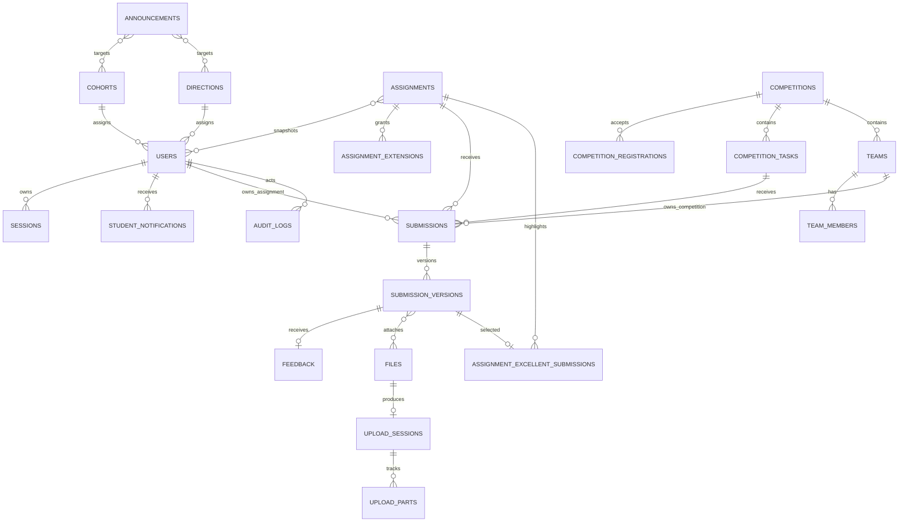

# 数据库结构

## 通用规则

- PostgreSQL 是唯一关系数据源；附件二进制只存 MinIO。
- 业务实体主键统一使用应用生成的 UUIDv7 和 PostgreSQL `uuid` 类型，便于按时间局部排序；只允许运维单例表使用文档明确的自然键。
- 时间统一使用 `TIMESTAMPTZ`；可变表包含 `created_at`、`updated_at` 和整数 `revision`。
- 邮箱在写入前规范化为小写并存入 `email_normalized`，以唯一索引比较；原始显示值存 `email`。
- 不采用全局通用软删除。用户和业务内容通过状态保留；可清理文件使用 `deleted_at`。正式版本、评语和审计日志不物理删除。
- 外键默认 `RESTRICT`；只对纯关联表使用 `CASCADE`。历史资源不得因删除基础配置而失去引用。
- 枚举通过 PostgreSQL enum 或受约束文本实现；迁移必须支持新增值的前滚策略。

## 枚举

| 枚举 | 值 |
| --- | --- |
| `user_role` | `student`, `admin` |
| `user_status` | `pending_email`, `active`, `disabled` |
| `announcement_status` | `draft`, `scheduled`, `published`, `archived` |
| `assignment_status` | `draft`, `published`, `closed`, `archived` |
| `competition_status` | `draft`, `registration_open`, `registration_closed`, `submission_open`, `submission_closed`, `archived` |
| `registration_status` | `registered`, `withdrawn`, `disqualified` |
| `team_status` | `forming`, `locked`, `invalid`, `dissolved`, `disqualified`, `archived` |
| `upload_status` | `initialized`, `uploading`, `verifying`, `available`, `rejected`, `aborted`, `expired` |
| `outbox_status` | `pending`, `processing`, `retry`, `sent`, `dead` |
| `audience_match` | `union`, `intersection` |

## 实体关系



## 身份与基础数据

### `cohorts`

`id`, `code`, `name`, `start_year`, `is_active`, `created_at`, `updated_at`, `revision`。

- `code` 全局唯一且不可复用；历史引用存在时只能停用。

### `directions`

`id`, `code`, `name`, `description`, `is_active`, `created_at`, `updated_at`, `revision`。

- `code` 全局唯一；用于机械、电控、视觉等技术方向。

### `users`

`id`, `email`, `email_normalized`, `student_number`, `full_name`, `password_hash`, `role`, `status`, `cohort_id`, `direction_id`, `email_verified_at`, `disabled_at`, `disabled_by`, `disabled_reason`, `password_changed_at`, `created_at`, `updated_at`, `revision`。

约束：

- `email_normalized` 和 `student_number` 分别唯一。
- Connect 用户名由 `email_normalized` 的 local-part 派生，不新增用户名列、独立唯一约束或可编辑用户名；旧域名存量账号不启用前缀登录。
- 数据库 CHECK 允许 `@hkust-gz.edu.cn` 存量行与 `@connect.hkust-gz.edu.cn` 新行共存；公开注册和管理员邮箱修改的 Service 只允许 Connect 域名。
- 任一 `active` 账号必须具有 `email_verified_at`；`cohort_id` 和 `direction_id` 均可空且不参与登录条件。
- 公开注册先创建 `pending_email student`；验证事务在固定 advisory lock 内确认没有任何 `active` 用户时把首个账号设为 `admin`，其余账号保持 `student`。同一事务锁也用于登录时确认不存在其他用户行；唯一的已验证 `active student` 必须提升为 `admin`、增加 revision、撤销旧 Session 并写审计。
- `password_hash` 只存 Argon2id 编码结果。
- 角色变更和状态变更均写 `audit_logs`。

索引：`(status, created_at)`、`(cohort_id, direction_id, status)`、`(role, status)`。

### `sessions`

`id`, `user_id`, `token_hash`, `csrf_secret_hash`, `created_at`, `last_seen_at`, `idle_expires_at`, `absolute_expires_at`, `revoked_at`, `ip_prefix`, `user_agent_summary`。

- `token_hash` 唯一；只存随机 Session 令牌的哈希。
- 读取使用 `token_hash` 索引，并过滤未撤销和未过期记录。
- 用户禁用、密码重置和角色敏感变更时批量撤销。

### `one_time_tokens`

`id`, `user_id`, `purpose`, `token_hash`, `expires_at`, `used_at`, `created_at`。

- `purpose` 仅为 `email_verification` 或 `password_reset`。
- `token_hash` 唯一；新令牌创建时使同用户同用途的旧令牌失效。

### `auth_security_events`

`id`, `event_type`, `email_normalized`, `user_id`, `ip_prefix`, `occurred_at`, `metadata`。

- 用于登录限流与安全分析；用户名和对应 Connect 完整邮箱都先写成同一个规范化完整邮箱，`metadata` 禁止密码、Cookie 和一次性令牌。
- 索引 `(email_normalized, occurred_at)` 和 `(ip_prefix, occurred_at)`。

## 通知与站内提醒

### `announcements`

`id`, `title`, `summary`, `body_markdown`, `body_html`, `status`, `all_students`, `audience_match`, `publish_at`, `published_at`, `pinned_until`, `send_email`, `created_by`, `updated_by`, `archived_at`, `created_at`, `updated_at`, `revision`。

- `body_html` 是经统一策略清洗后的缓存。
- `all_students=true` 时不得存在届次/方向关联。
- `scheduled` 必须有未来 `publish_at`；`published` 必须有 `published_at`。

### `announcement_cohorts`、`announcement_directions`

分别包含 `(announcement_id, cohort_id)` 和 `(announcement_id, direction_id)` 复合主键。用于配置受众；发布时另外生成逐用户通知记录作为发送快照。

### `announcement_files`

`announcement_id`, `file_id`, `display_order`。复合唯一约束保证同一附件不重复绑定。

### `student_notifications`

`id`, `user_id`, `notification_type`, `event_key`, `title`, `target_type`, `target_id`, `target_url`, `created_at`, `read_at`。

- `(user_id, event_key)` 唯一，保证重试不生成重复提醒。
- 索引 `(user_id, read_at, created_at DESC)`。

## 作业与受众快照

### `assignments`

`id`, `title`, `description_markdown`, `description_html`, `training_url`, `submission_instructions`, `status`, `all_students`, `audience_match`, `allowed_extensions`, `max_total_bytes`, `publish_at`, `published_at`, `deadline`, `created_by`, `updated_by`, `closed_at`, `archived_at`, `created_at`, `updated_at`, `revision`。

- `allowed_extensions` 存规范化小写数组，并由服务层保证是全局白名单子集。
- `max_total_bytes` 满足 `1 <= value <= 2147483648`。
- `deadline > publish_at`。

### `assignment_cohorts`、`assignment_directions`

保存发布前的受众配置，结构与通知关联表相同。

### `assignment_audience_users`

`assignment_id`, `user_id`, `cohort_id_at_publish`, `direction_id_at_publish`, `created_at`，复合主键 `(assignment_id, user_id)`。

- 发布事务中生成，是 HW-002 的固定受众快照。
- 学生后续调整方向不修改此表。

### `assignment_extensions`

`assignment_id`, `user_id`, `extended_deadline`, `reason`, `granted_by`, `created_at`, `updated_at`, `revision`。

- 复合唯一 `(assignment_id, user_id)`。
- `extended_deadline` 必须晚于作业公共截止时间。

## 赛事、报名与队伍

### `competitions`

`id`, `name`, `description_markdown`, `description_html`, `rules_url`, `status`, `registration_start`, `registration_end`, `submission_start`, `submission_end`, `min_team_size`, `max_team_size`, `created_by`, `updated_by`, `published_at`, `archived_at`, `created_at`, `updated_at`, `revision`。

约束：

- `registration_start < registration_end <= submission_start < submission_end`。
- `1 <= min_team_size <= max_team_size <= 20`。
- 状态只允许按规定方向推进。

### `competition_registrations`

`id`, `competition_id`, `user_id`, `status`, `registered_at`, `withdrawn_at`, `disqualified_at`, `disqualified_by`, `disqualification_reason`, `created_at`, `updated_at`, `revision`。

- `(competition_id, user_id)` 唯一；重新报名复用记录并校验状态。
- 索引 `(competition_id, status)`。

### `competition_tasks`

`id`, `competition_id`, `title`, `description_markdown`, `description_html`, `resource_url`, `allowed_extensions`, `max_total_bytes`, `deadline`, `display_order`, `created_at`, `updated_at`, `revision`。

- `deadline` 位于赛事提交窗口内。
- `(competition_id, display_order)` 唯一。

### `teams`

`id`, `competition_id`, `name`, `status`, `captain_user_id`, `invite_code_hash`, `invite_code_rotated_at`, `min_size_waived_at`, `min_size_waived_by`, `waiver_reason`, `disqualified_at`, `disqualified_by`, `disqualification_reason`, `created_at`, `updated_at`, `locked_at`, `dissolved_at`, `revision`。

- `(competition_id, lower(name))` 对未解散队伍唯一。
- `captain_user_id` 必须是当前有效成员，由 Service 事务保证。
- 邀请码只保存慢哈希或带服务端 pepper 的 HMAC，不保存明文。

### `team_members`

`id`, `team_id`, `competition_id`, `user_id`, `joined_at`, `left_at`, `added_by_admin`, `admin_reason`。

- 部分唯一索引 `(competition_id, user_id) WHERE left_at IS NULL` 保证一赛一队。
- 唯一 `(team_id, user_id, joined_at)` 保留重新加入历史。
- Service 验证 `competition_id` 与 `teams.competition_id` 一致。
- 索引 `(team_id, left_at)`。

## 提交、版本和评语

### `submissions`

`id`, `assignment_id`, `competition_task_id`, `owner_user_id`, `owner_team_id`, `latest_version_id`, `created_at`, `updated_at`。

核心检查约束：

```sql
CHECK (
  (assignment_id IS NOT NULL AND competition_task_id IS NULL
   AND owner_user_id IS NOT NULL AND owner_team_id IS NULL)
  OR
  (assignment_id IS NULL AND competition_task_id IS NOT NULL
   AND owner_user_id IS NULL AND owner_team_id IS NOT NULL)
)
```

- 部分唯一 `(assignment_id, owner_user_id) WHERE assignment_id IS NOT NULL`。
- 部分唯一 `(competition_task_id, owner_team_id) WHERE competition_task_id IS NOT NULL`。
- `latest_version_id` 在创建版本事务结束前指向同一提交的版本；使用延迟外键或迁移后追加外键解决建表循环。

### `submission_versions`

`id`, `submission_id`, `version_number`, `submitted_by`, `text_markdown`, `text_html`, `external_url`, `total_file_bytes`, `idempotency_key`, `submitted_at`。

- `(submission_id, version_number)` 唯一，`version_number >= 1`。
- `(submitted_by, idempotency_key)` 唯一。
- `text_markdown`、`external_url` 和附件至少一种存在，由 Service 验证。
- 行创建后禁止 `UPDATE` 和 `DELETE`；必要纠错创建新版本。

### `version_files`

`version_id`, `file_id`, `display_order`，复合主键 `(version_id, file_id)`。

- 同一文件只允许绑定一个正式版本或一个通知，避免跨用户引用。
- 绑定事务再次验证文件所有者、状态和合计大小。

### `feedback`

`id`, `version_id`, `body_markdown`, `body_html`, `created_by`, `created_at`, `updated_at`, `revision`。

- `version_id` 唯一，一版最多一条当前评语。
- 修订差异写入审计，表中保留当前版本；不提供评分字段。

## 优秀作业

### `assignment_excellent_submissions`

`assignment_id`, `version_id`, `marked_by`, `marked_at`，复合主键 `(assignment_id, version_id)`。

- `version_id` 另设唯一约束，避免同一版本被重复标记。
- Service 必须验证该版本的 `submission.assignment_id` 等于记录的 `assignment_id`，并拒绝 `competition_task_id` 非空的赛事版本。
- 该表存在即表示优秀标记生效；取消标记删除关联行，不删除源提交版本、附件或审计日志。
- 作业受众从源版本读取全部文本、链接和附件，并通过 `submitted_by` 关联用户姓名；`feedback` 永不参与优秀作业响应。
- 关联存在期间，源版本和其 `version_files` 禁止进入合规删除流程。

## 文件和上传

### `files`

`id`, `owner_user_id`, `purpose`, `object_key`, `original_name`, `extension`, `declared_media_type`, `detected_media_type`, `size_bytes`, `sha256`, `status`, `created_at`, `available_at`, `deleted_at`。

- `object_key` 唯一且不可由客户端指定。
- `sha256` 为 64 位小写十六进制；`size_bytes >= 0`。
- 索引 `(owner_user_id, status, created_at)`、`(status, created_at)`。

### `upload_sessions`

`id`, `file_id`, `user_id`, `purpose`, `context_type`, `context_id`, `minio_upload_id`, `part_size_bytes`, `part_count`, `expected_size_bytes`, `expected_sha256`, `status`, `last_activity_at`, `expires_at`, `idempotency_key`, `created_at`, `completed_at`, `failure_code`。

- `(user_id, idempotency_key)` 唯一。
- `expires_at` 默认最后活动时间后 24 小时。
- `minio_upload_id` 视为敏感内部标识，不通过日志输出。

### `upload_parts`

`upload_session_id`, `part_number`, `etag`, `checksum_sha256`, `size_bytes`, `completed_at`，复合主键 `(upload_session_id, part_number)`。

- `1 <= part_number <= upload_sessions.part_count`。

## Outbox、幂等与审计

### `worker_heartbeats`

`worker_name`, `started_at`, `last_heartbeat_at`, `updated_at`。

- `worker_name` 是长度不超过 100 的自然主键；首版默认值为 `primary`，用于区分未来并行 Worker，而不是业务租户。
- Worker 启动后立即写入并按配置周期原子更新；API 只返回名称、启动时间、最近心跳和安全的心跳年龄。
- 索引 `last_heartbeat_at` 支持 NFR-008 的陈旧心跳检查和独立告警。
- 该表由首条 Alembic 迁移 `20260823_0001` 创建，可完整降级删除；它是阶段 1 唯一已创建的数据库表。

### `outbox_jobs`

`id`, `job_type`, `event_key`, `payload`, `secret_payload_ciphertext`, `status`, `available_at`, `attempt_count`, `max_attempts`, `locked_by`, `locked_at`, `last_error_code`, `last_error_summary`, `created_at`, `sent_at`。

- `event_key` 唯一，是 MAIL-005 的幂等依据。
- `payload` 只含完成任务所需的资源 ID和非秘密模板变量，不保存密码、Cookie 或明文一次性令牌。
- `secret_payload_ciphertext` 可空，只用于保存经独立 Outbox 密钥认证加密的投递秘密；不得通过管理 API、日志或审计返回。
- 领取索引 `(status, available_at)`；Worker 使用 `FOR UPDATE SKIP LOCKED`。
- 邮件管理 API 只查询 `job_type` 为邮件的记录并对接收方脱敏。

### `idempotency_records`

`id`, `user_id`, `endpoint_key`, `idempotency_key`, `request_hash`, `response_status`, `response_body`, `resource_id`, `expires_at`, `created_at`。

- `(user_id, endpoint_key, idempotency_key)` 唯一。
- 同键不同 `request_hash` 返回 `IDEMPOTENCY_CONFLICT`。

### `audit_logs`

`id`, `actor_user_id`, `action`, `target_type`, `target_id`, `request_id`, `ip_prefix`, `result`, `change_summary`, `created_at`。

- 只追加，不更新、不通过产品接口删除。
- `change_summary` 是脱敏 JSONB，只保存变更字段和安全摘要。
- 索引 `(actor_user_id, created_at DESC)`、`(target_type, target_id, created_at DESC)`、`request_id`。

## 需求与实体映射

| 需求域 | 核心表 |
| --- | --- |
| AUTH | `users`, `sessions`, `one_time_tokens`, `auth_security_events`, `cohorts`, `directions` |
| NEWS、MAIL | `announcements`, 受众关联表, `student_notifications`, `outbox_jobs` |
| HW | `assignments`, 受众配置与快照, `assignment_extensions` |
| COMP、TEAM | `competitions`, `competition_tasks`, `competition_registrations`, `teams`, `team_members` |
| SUB | `submissions`, `submission_versions`, `version_files`, `feedback` |
| SHOW | `assignment_excellent_submissions`、作业与版本外键、源附件删除保护 |
| FILE | `files`, `upload_sessions`, `upload_parts` |
| NFR-006 | `audit_logs` |
| NFR-008 | `worker_heartbeats` |

## 迁移规则

1. 每次结构变化只提交一条职责明确的 Alembic 迁移链，不手工修改生产表。
2. 大表新增非空字段采用“可空字段 → 回填 → 约束”三阶段，避免长时间锁表。
3. 删除列或枚举值采用至少一个版本的弃用窗口，先停止读取和写入，再迁移数据，最后移除。
4. 生产迁移前完成 PostgreSQL 备份；不可逆迁移必须给出经过测试的前滚恢复方案。
5. 迁移测试从空库升级到最新，也从上一个发布版本升级到最新，并验证全部检查、唯一和外键约束。
6. 数据修正迁移 `20260825_0007` 不改变结构，只在用户表恰好一行且该行是已验证 `active student` 时提升为管理员、撤销旧 Session 并追加审计；降级保留已授予角色，避免系统重新失去管理员。
