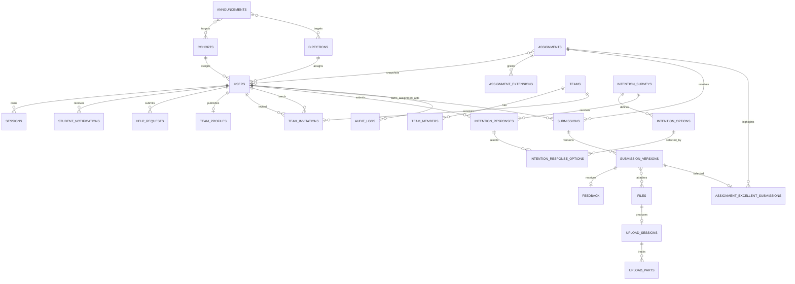

# 数据库结构

## 通用规则

- PostgreSQL 是唯一关系数据源；附件二进制只存 MinIO。
- 业务实体主键统一使用应用生成的 UUIDv7 和 PostgreSQL `uuid` 类型，便于按时间局部排序；只允许运维单例表使用文档明确的自然键。
- 时间统一使用 `TIMESTAMPTZ`；可变表包含 `created_at`、`updated_at` 和整数 `revision`。
- 邮箱在写入前规范化为小写并存入 `email_normalized`，以唯一索引比较；原始显示值存 `email`。
- 不采用全局通用软删除。已进入用户生命周期的业务内容通过状态保留；未发布通知/作业可在受审计删除事务中物理删除，可清理文件使用 `deleted_at`。正式版本、评语和审计日志通常不物理删除；唯一例外是 AUTH-012 账号擦除中属于目标用户的个人提交树。legacy 团队版本与共享业务事实继续保留但不提供运行时读取。
- 外键默认 `RESTRICT`；只对纯关联表使用 `CASCADE`。历史资源不得因删除基础配置而失去引用。
- 枚举通过 PostgreSQL enum 或受约束文本实现；迁移必须支持新增值的前滚策略。

## 枚举

| 枚举 | 值 |
| --- | --- |
| `user_role` | `student`, `admin` |
| `user_status` | `pending_email`, `active`, `disabled` |
| `announcement_status` | `draft`, `scheduled`, `published`, `archived` |
| `assignment_status` | `draft`, `published`, `closed`, `archived` |
| `team_status` | 当前独立队伍只允许 `forming`, `dissolved` |
| `team_invitation_status` | `pending`, `accepted`, `declined`, `cancelled` |
| legacy `competition_status` | `draft`, `registration_open`, `registration_closed`, `submission_open`, `submission_closed`, `archived` |
| legacy `registration_status/team_status` | `registered`, `withdrawn`, `disqualified`；原队伍另含 `forming`, `locked`, `invalid`, `dissolved`, `disqualified`, `archived` |
| `upload_status` | `initialized`, `uploading`, `verifying`, `available`, `rejected`, `aborted`, `expired` |
| `outbox_status` | `pending`, `processing`, `retry`, `sent`, `dead` |
| `audience_match` | `union`, `intersection` |
| `help_request_type` | `system_feedback`, `question` |
| `help_request_status` | `open`, `resolved` |

## 实体关系



当前关系图只展示运行时产品实体；旧赛事、报名、赛题、原队伍及其提交关系由 0020 legacy 结构原样保存，见“独立队伍与 legacy 赛事数据”，不连接当前 `TEAMS`。

## 身份与基础数据

### `cohorts`

`id`, `code`, `name`, `start_year`, `is_active`, `created_at`, `updated_at`, `revision`。

- `code` 全局唯一且不可复用；历史引用存在时只能停用。
- 届次设置已从产品入口移除；表结构和数据保留，用于历史通知/作业受众、快照及旧 API 兼容，不在本次变更中物理删除。

### `directions`

`id`, `code`, `name`, `description`, `is_active`, `created_at`, `updated_at`, `revision`。

- `code` 全局唯一；用于机械、电控、视觉等技术方向。

### `users`

`id`, `email`, `email_normalized`, `student_number`, `full_name`, `password_hash`, `role`, `status`, `cohort_id`, `direction_id`, `email_verified_at`, `disabled_at`, `disabled_by`, `disabled_reason`, `password_changed_at`, `created_at`, `updated_at`, `revision`。

约束：

- `email_normalized` 和 `student_number` 分别唯一。
- Connect 用户名由 `email_normalized` 的 local-part 派生，不新增用户名列、独立唯一约束或可编辑用户名；旧域名存量账号不启用前缀登录。
- 数据库 CHECK 允许 `@hkust-gz.edu.cn` 存量行与 `@connect.hkust-gz.edu.cn` 新行共存；公开注册和管理员邮箱修改的 Service 只允许 Connect 域名。
- 任一 `active` 账号必须具有 `email_verified_at`；`cohort_id` 和 `direction_id` 均可空且不参与登录条件。新产品只维护 `direction_id`，`cohort_id` 仅保留历史兼容。
- 管理员按问卷第一志愿批量配置方向时复用 `direction_id`，只更新当前 `active student` 且在值实际变化时增加用户 revision；`updated_at` 由既有 ORM 更新语义维护。本功能不新增用户字段或索引。
- 公开注册先创建 `pending_email student`；验证事务在固定 advisory lock 内确认没有任何 `active` 用户时把首个账号设为 `admin`，其余账号保持 `student`。同一事务锁也用于登录时确认不存在其他用户行；唯一的已验证 `active student` 必须提升为 `admin`、增加 revision、撤销旧 Session 并写审计。
- `password_hash` 只存 Argon2id 编码结果。
- 角色变更和状态变更均写 `audit_logs`。

索引：`(status, created_at)`、`(cohort_id, direction_id, status)`、`(role, status)`。届次索引暂保留，供历史受众查询使用。管理员账号搜索在现有约 300 账号容量边界内，于分页前对 `email_normalized`、`full_name`、`student_number` 做转义后的大小写不敏感包含匹配，并把中文/英文角色与状态名称映射到枚举条件；`%`、`_` 和反斜杠按普通文本处理。用户页按技术组查看继续使用同一查询的 `users.direction_id = :direction_id` 精确条件和现有组合索引。本行为不新增字段、索引或 Alembic 迁移。

### `sessions`

`id`, `user_id`, `token_hash`, `csrf_secret_hash`, `created_at`, `last_seen_at`, `idle_expires_at`, `absolute_expires_at`, `revoked_at`, `student_view`, `ip_binding_hash`, `ip_prefix`, `user_agent_summary`。

- `token_hash` 唯一；只存随机 Session 令牌的哈希。
- 读取使用 `token_hash` 索引，并过滤未撤销和未过期记录。
- 用户禁用、密码重置和角色敏感变更时批量撤销。
- `student_view` 为非空布尔值，默认 `false`，只表示当前 Session 的临时有效角色，不修改 `users.role`；管理员切换开关时写入 `audit_logs`。真实角色变更必须撤销该用户全部 Session，因此降级后不能由本人恢复管理员视图。
- `ip_binding_hash` 可空且固定为 64 位十六进制 HMAC：`NULL` 表示普通或迁移前历史会话，非空表示用户主动选择的持久会话。HMAC 以原始高熵 Session token 为 key、以规范化精确来源 IP 为消息；数据库只保留摘要和既有 `/24` 或 `/64` 展示网段，不保存精确 IP。它不建用户/IP 查询索引，也不能作为独立身份凭证。

### `one_time_tokens`

`id`, `user_id`, `purpose`, `token_hash`, `expires_at`, `used_at`, `created_at`。

- `purpose` 仅为 `email_verification` 或 `password_reset`。
- `token_hash` 唯一；新令牌创建时使同用户同用途的旧令牌失效。

### `auth_security_events`

`id`, `event_type`, `email_normalized`, `user_id`, `ip_prefix`, `occurred_at`, `metadata`。

- 用于无效登录限流与安全分析；用户名和对应 Connect 完整邮箱都先写成同一个规范化完整邮箱，`metadata` 禁止密码、Cookie 和一次性令牌。
- `registration`、`verification_resend` 和 `password_reset_request` 事件继续保留用于安全分析，但应用层不再查询其历史计数或据此返回持久等待；既有记录不删除。
- 成功登录不删除、清空或改写既有失败事件；已验证 `active` 账号的正确密码路径不读取这些事件作为持久冷却条件。本次行为调整不新增字段或迁移。
- 索引 `(email_normalized, occurred_at)` 和 `(ip_prefix, occurred_at)`。

## 通知与站内提醒

### `announcements`

`id`, `title`, `summary`, `body_markdown`, `body_html`, `status`, `all_students`, `audience_match`, `publish_at`, `published_at`, `pinned_until`, `send_email`, `created_by`, `updated_by`, `archived_at`, `deleted_at`, `created_at`, `updated_at`, `revision`。

- `body_html` 是经统一策略清洗后的缓存。
- `all_students=true` 时不得存在届次/方向关联。新建产品流程只写方向关联；历史届次关联继续保留。
- `scheduled` 必须有未来 `publish_at`；`published` 必须有 `published_at`。
- 管理员删除 `draft/scheduled` 时可物理删除本行并依赖纯关联外键级联；删除 `published` 时转为 `archived` 并写 `deleted_at`，手工归档保持空值直至再次删除。约束保证 `deleted_at IS NULL OR status='archived'`；普通详情与管理列表只读取空值行。

### `announcement_cohorts`、`announcement_directions`

分别包含 `(announcement_id, cohort_id)` 和 `(announcement_id, direction_id)` 复合主键。用于配置受众；发布时另外生成逐用户通知记录作为发送快照。新建通知不再写入 `announcement_cohorts`，历史关联只读兼容。

### `announcement_files`

`announcement_id`, `file_id`, `display_order`。复合唯一约束保证同一附件不重复绑定。

### `student_notifications`

`id`, `user_id`, `notification_type`, `event_key`, `title`, `target_type`, `target_id`, `target_url`, `created_at`, `read_at`。

- 表名是历史兼容名称，语义为任一登录用户的站内提醒；`user_id` 可指向学生或管理员，本次不重命名、不新增字段或 Alembic 迁移。
- `(user_id, event_key)` 唯一，保证重试不生成重复提醒。
- 索引 `(user_id, read_at, created_at DESC)`。
- 工作台按 `target_type/target_url` 把未读提醒归入公告、作业、校内赛和反馈答疑；公告分类只统计仍为 `published` 的目标，历史遗留的归档公告提醒不进入有效未读数。
- 公告归档在同一事务把该公告当前未读提醒写入 `read_at`；学生读取公告或本人工单详情后仍通过既有受 CSRF 保护的单条已读接口更新，不通过 GET 隐式写入。
- 学生创建工单时，每个当前 `active admin` 各写一行 `notification_type='help_request_created'`、`event_key='help_request_created:{request_id}'`；唯一约束包含 `user_id`，所以多个管理员可共享同一事件键。固定标题不含工单标题、正文、姓名、学号或邮箱。管理员侧计数和详情均按当前 `user_id` 过滤，打开详情仍通过受保护写接口标记本人行已读。
- 已发布公告的删除复用归档语义，不删除历史 `student_notifications`；未发布公告尚未生成逐学生提醒。

## 反馈答疑

### `help_requests`

`id`, `request_type`, `status`, `title`, `content_markdown`, `content_html`, `resolution_markdown`, `resolution_html`, `created_by`, `resolved_by`, `resolved_at`, `created_at`, `updated_at`, `revision`。

- `request_type` 只允许 `system_feedback`、`question`，`status` 只允许 `open`、`resolved`；标题去除首尾空白后长度为 1～200，学生正文为 1～20,000 字符。
- `content_html` 和非空的 `resolution_html` 都由统一安全 Markdown 渲染器生成；数据库保存当前答复，不建立公开评论或多轮消息表。
- `created_by` 以 `ON DELETE CASCADE` 引用 `users`，因此账号擦除删除本人工单；`resolved_by` 可空并以 `ON DELETE SET NULL` 保留其他人的已解决工单。`open` 必须没有答复者、答复时间或答复正文；`resolved` 必须具有非空答复和答复时间，答复管理员已删除时允许答复者为空。
- 学生列表索引 `(created_by, created_at DESC, id DESC)`；管理员筛选索引 `(status, request_type, created_at DESC, id DESC)`。
- 工单创建、审计和全部当前有效管理员的创建提醒在同一事务提交；提醒写入失败会回滚工单。管理员首次答复或修订答复时锁定本行、校验 `revision`，并在同一事务写 `audit_logs` 和学生 `student_notifications`；通知事件键为 `help_request_resolved:{request_id}:{revision}`，只包含安全标题和本人详情链接。首次答复同时把全部管理员对此工单的未读创建提醒写入 `read_at`，修订不重复处理。
- 不新增 `is_public` 字段或迁移；登录态公开查询固定选择 `request_type='question' AND status='resolved'`，复用管理员筛选索引且不连接 `users`。因此开放问题和全部系统反馈始终私密，问题首次解决即公开，答复修订直接反映最新版本。

- 管理员删除任意状态工单时锁定本行，在同一事务把目标工单全部未读创建/解决提醒写入 `read_at`、写脱敏审计并物理删除 `help_requests` 行；历史已读提醒和审计不级联删除。复用现有表、约束与索引，不新增 `deleted_at`、状态枚举或 Alembic 迁移。
## 作业与受众快照

### `assignments`

`id`, `title`, `description_markdown`, `description_html`, `training_url`, `submission_instructions`, `status`, `all_students`, `audience_match`, `allowed_extensions`, `max_total_bytes`, `publish_at`, `published_at`, `deadline`, `created_by`, `updated_by`, `closed_at`, `archived_at`, `deleted_at`, `created_at`, `updated_at`, `revision`。

- `allowed_extensions` 存规范化小写数组，并由服务层保证是全局白名单子集。
- `max_total_bytes` 满足 `1 <= value <= 2147483648`。
- `deadline > publish_at`。
- `published/closed` 更新在 Service 的作业行锁内允许替换受众配置，继续冻结 `publish_at`、`allowed_extensions` 和 `max_total_bytes`；公共截止前移时聚合读取本作业 `submission_versions.submitted_at` 最大值，禁止早于已有正式提交，并与 `close_assignment` Outbox 及自动/提前关闭语义协调。该规则复用现有字段和索引，不新增迁移。
- 管理员删除 `draft` 时可物理删除本行；`published/closed` 删除转为 `archived` 并写 `deleted_at`，手工归档保持空值直至再次删除。约束保证 `deleted_at IS NULL OR status='archived'`；普通详情与管理列表只读取空值行，关联提交与版本继续受 `RESTRICT` 和不可变规则保护。

### `assignment_cohorts`、`assignment_directions`

保存发布前的受众配置，结构与通知关联表相同。新建作业不再写入 `assignment_cohorts`，历史关联只读兼容。

### `assignment_audience_users`

`assignment_id`, `user_id`, `cohort_id_at_publish`, `direction_id_at_publish`, `created_at`，复合主键 `(assignment_id, user_id)`。

- 发布事务生成初始受众；后续账号首次激活为普通学生时，同一激活事务为仍处于 `published`、未过公共截止且匹配的作业追加该学生。
- 管理员修改 `published/closed` 作业受众时，在同一作业事务删除旧快照并按当前 `active student` 重建；`cohort_id_at_publish` 和 `direction_id_at_publish` 记录本次快照生成时分类。学生后续自行调整方向不会自动修改此表。
- 快照移除不级联删除 `submissions`、版本、评语、优秀标记、附件、延期、提醒或审计；管理名单以当前快照与历史提交者并集查询。

### `assignment_extensions`

`assignment_id`, `user_id`, `extended_deadline`, `reason`, `granted_by`, `created_at`, `updated_at`, `revision`。

- 复合唯一 `(assignment_id, user_id)`。
- `extended_deadline` 必须晚于作业公共截止时间。

## 独立队伍与 legacy 赛事数据

### `teams`

当前产品表字段：`id`、`name`、`status`、`captain_user_id`、`invite_code_hash`、`invite_code_rotated_at`、`max_members`、`dissolved_at`、`created_at`、`updated_at`、`revision`。

- `status` 只允许 `forming/dissolved`；`forming` 必须有当前队长且 `dissolved_at` 为空，`dissolved` 必须无队长且 `dissolved_at` 非空。
- `lower(name)` 对 `forming` 队伍全局唯一；`max_members` 为 1～20，当前默认 5。
- `captain_user_id` 使用 `users.id RESTRICT` 外键，并由延迟约束触发器保证队长是本队当前成员。
- 邀请码只保存带服务端 pepper 的 HMAC，不保存明文。公开目录只从队伍和有效成员计数生成，不连接用户身份字段。
- 自动分配锁定 forming 候选队伍，按成员数、created_at 和 id 选择；无候选时创建新队伍。
- 管理员删除独立队伍时物理删除本行并级联当前/历史成员关系与邀请；学生解散先取消 pending 邀请。该表不被任何当前提交引用。

### `team_members`

当前产品表字段：`id`、`team_id`、`user_id`、`joined_at`、`left_at`、`added_by_admin`、`admin_reason`。

- 部分唯一索引 `user_id WHERE left_at IS NULL` 保证每名学生全局最多一支当前队伍。
- 唯一 `team_id, user_id, joined_at` 保留重新加入历史；索引 `team_id, left_at` 支持成员装载。
- `team_id` 和 `user_id` 分别使用 `CASCADE` 外键；管理员补录必须同时保存非空 `admin_reason`，普通加入不得保存原因。

### `team_profiles`
### `team_settings`

固定单例行：`id=true`、`is_team_open`、`created_at`、`updated_at`、`revision`。`id` 检查约束确保单行语义，迁移默认插入关闭状态。

- 不存储学生个人资料或组队内容；downgrade 只删除该设置表，不影响当前队伍、简介、邀请或历史赛事表。


字段：`user_id`、`introduction`、`created_at`、`updated_at`、`revision`。

- `user_id` 同时为主键和 `users.id ON DELETE CASCADE` 外键，每个账号最多一份简介；账号删除时简介随个人数据清理。
- `length(trim(introduction)) BETWEEN 1 AND 2000` 保证非空纯文本边界，`updated_at` 索引支持目录按最近更新排序。
- 是否进入目录同时由关联用户当前 `role=student/status=active` 决定；方向和姓名从用户表读取，不在简介表复制，简介不承担通用账号资料职责。

### `team_invitations`

字段：`id`、`team_id`、`invitee_user_id`、`invited_by_user_id`、`status`、`responded_at`、`created_at`、`updated_at`、`revision`。

- `team_id`、受邀者和发送者分别以 `ON DELETE CASCADE` 关联当前 `teams/users`；邀请不保存邮箱、姓名、简介副本或邀请码。
- `status` 只允许 `pending/accepted/declined/cancelled`；pending 必须没有 `responded_at`，其他状态必须有处理时间，且发送者不能等于受邀者。
- 部分唯一索引 `(team_id, invitee_user_id) WHERE status='pending'` 保证同队同目标最多一条待处理邀请；受邀者+状态+创建时间和队伍+状态索引支持本人列表与取消。
- 接受邀请仍以 `team_members.user_id WHERE left_at IS NULL` 为一人一队最终约束；成功后当前邀请为 accepted，本人其他 pending 邀请为 cancelled。

### legacy 赛事与原队伍

迁移 `20260904_0020` 把原 `teams/team_members` 重命名为 `legacy_competition_teams/legacy_competition_team_members`，并原位保留 `competitions`、`competition_registrations`、`competition_tasks`、历史赛事提交及其附件/评语关系。它们不属于当前产品模型，不由 Router、Service、Repository、Worker 或页面查询。

Alembic 只精确排除这五张 legacy 表，以及 `submissions` 上已知的历史赛事外键、检查约束和索引。`submissions` 的 `competition_task_id`、`owner_team_id` 仍以可空内部兼容列进入 ORM 元数据，防止 Alembic 误报删除；所有当前 Submission Repository 查询必须包含 `assignment_id IS NOT NULL`。`files` 的数据库 `purpose` 检查继续允许 `competition_submission` 只为承载历史元数据，公共上传 Schema 和 Service 仅接受 `announcement_attachment/assignment_submission`。

## 学生问卷

### `intention_surveys`

`id`, `title`, `description_markdown`, `description_html`, `status`, `all_students`, `max_submissions`, `starts_at`, `ends_at`, `public_token_hash`, `created_by`, `updated_by`, `created_at`, `updated_at`, `revision`。

- `status` 只允许 `draft`、`open`、`closed`、`archived`；Service 允许 `draft → open → closed`、`closed → open` 和 `closed → archived`，归档为终态。重新开启只更新问卷根记录的状态、操作者、时间与 revision；非归档编辑可更新问卷根字段和受众，`open/closed` 另可原位更新题目文字，但不修改题目/选项身份、回答、提交次数或 token。
- `all_students` 为非空布尔值；`true` 表示全部学生，`false` 表示只允许 `intention_survey_directions` 中技术组的当前学生。`20260904_0019` 对既有行使用 `true` 服务端默认，保持原可见范围。
- 标题去除首尾空白后长度为 1～200；开始和结束时间同时存在时必须 `starts_at < ends_at`。
- `description_html` 由统一安全 Markdown 渲染器生成；`public_token_hash` 是唯一 64 位 SHA-256 十六进制值，不保存二维码明文 token。
- `max_submissions` 为 1～100 的正整数或 `NULL`（不限次数）；索引 `(status, starts_at, ends_at)` 支持学生开放问卷查询。

### `intention_survey_directions`

`survey_id`, `direction_id`，复合主键 `(survey_id, direction_id)`。

- 问卷删除时关系 `ON DELETE CASCADE`；技术组仍被问卷引用时 `ON DELETE RESTRICT`，另有 `direction_id` 索引支持方向反查。
- Service 保证 `all_students=true` 时没有关联，受限问卷保存 1～50 个不重复且创建/任一非归档编辑时启用的技术组；首次开放再次复核启用状态，归档后关系冻结。调整受众只影响后续资格，不删除既有回答。
- 学生列表查询以 `all_students=true OR 当前 users.direction_id 命中关系` 过滤；详情、二维码和提交继续独立查验。统计分母和问卷“全部”邮件范围用这些技术组中当前 `active student` 计算，回答关系不因用户后续换组而删除。

### `intention_questions`

`id`, `survey_id`, `prompt`, `allow_multiple`, `display_order`。

- `draft` 编辑可级联替换问题与选项；`open/closed` 编辑只允许原位更新 `prompt`，并要求问题数量/顺序、`allow_multiple` 及所属选项数量/文字/顺序全部不变，以保持回答外键及答案语义。

- 问卷删除时级联删除问题；`prompt` 去空白后长度 1～200，`display_order >= 0`。
- `(survey_id, display_order)` 唯一；每题独立使用 `allow_multiple` 表达单选或多选。

### `intention_options`

`id`, `question_id`, `label`, `display_order`。

- `question_id` 删除时级联删除选项；`label` 去空白后非空，`display_order >= 0`。
- `(question_id, display_order)` 唯一；Service 额外按去空白后的大小写折叠标签拒绝同题重复选项。

### `intention_responses`

`id`, `survey_id`, `user_id`, `free_text`, `submission_count`, `submitted_at`, `created_at`, `updated_at`, `revision`。

- `(survey_id, user_id)` 唯一，保证同一学生只保留一份最新回答；每次成功覆盖时原子增加正整数 `submission_count`、更新时间和 revision，不保留被覆盖的答案历史。
- `user_id` 对账号使用 `ON DELETE CASCADE`，问卷删除也级联删除回答。管理员删除问卷是明确的永久数据删除操作；账号擦除只删除目标用户答案和选择，不改变问卷及其他人的汇总。

### `intention_response_options`

`response_id`, `option_id`，复合主键 `(response_id, option_id)`。

- 回答删除时级联删除选择；选项仍被引用时 `RESTRICT`。永久删除问卷前 Repository 先按 `survey_id` 显式删除全部回答选择，再删除问卷根记录，避免级联删除题目/选项时被限制外键阻断；这些操作与审计、Outbox 清理同事务提交。
- Service 在写入前锁定问卷和本人回答，验证全部问题、问题归属、选项归属及每题选择数量，并在同一事务校验/增加提交次数；数据库唯一约束处理并发首次填写。
- 管理员统计只聚合回答数和分题选项选择数；实名名单通过受管理员保护的查询连接 `users`，批量装载最新选择，只返回需求允许字段。
- 第一志愿方向配置连接 `intention_responses`、`intention_response_options` 与第一题选项，按用户 UUID 稳定锁定符合条件账号并更新 `users.direction_id/revision`；`(survey_id,user_id)` 唯一约束保证取到的是每人的唯一最新回答。选择表和回答表保持不变，既有 `assignment_audience_users` 也不补写或重算，因此无需 Alembic 迁移；应用回滚不会自动恢复已经明确写入的用户方向。
- 方向配置资格直接复用已规范化保存的 `intention_surveys.title`：去除首尾空白后只接受精确值“意向选择”。该应用层规则不新增列、检查约束、索引或 Alembic 迁移。

## 提交、版本和评语

### `submissions`

`id`, `assignment_id`, `competition_task_id`, `owner_user_id`, `owner_team_id`, `latest_version_id`, `created_at`, `updated_at`。

当前运行时只创建和查询 `assignment_id/owner_user_id` 分支，所有 Repository 查询都限制 `assignment_id IS NOT NULL`。`competition_task_id/owner_team_id` 及下述第二分支仅用于匹配并保留 legacy 数据库结构，不注册读取或写入 API。

核心检查约束：

```sql
CHECK (
  (assignment_id IS NOT NULL AND competition_task_id IS NULL
   AND owner_user_id IS NOT NULL AND owner_team_id IS NULL)
  OR
  (assignment_id IS NULL AND competition_task_id IS NOT NULL
   AND owner_user_id IS NULL AND owner_team_id IS NOT NULL)
)
```

- 部分唯一 `(assignment_id, owner_user_id) WHERE assignment_id IS NOT NULL`。
- legacy 部分唯一 `(competition_task_id, owner_team_id) WHERE competition_task_id IS NOT NULL`。
- `latest_version_id` 在创建版本事务结束前指向同一提交的版本；使用延迟外键或迁移后追加外键解决建表循环。

- `owner_user_id` 对账号使用 `ON DELETE CASCADE`，只删除目标用户的个人作业提交；`owner_team_id` 继续保留 legacy 团队赛事提交，但当前 Service 不读取。擦除前 Service 把个人提交的 `latest_version_id` 置空，再由提交外键向版本树级联。

### `submission_versions`

`id`, `submission_id`, `version_number`, `submitted_by`, `text_markdown`, `text_html`, `external_url`, `total_file_bytes`, `idempotency_key`, `submitted_at`。

- `(submission_id, version_number)` 唯一，`version_number >= 1`。
- `(submitted_by, idempotency_key)` 唯一。
- `text_markdown`、`external_url` 和附件至少一种存在，由 Service 验证。
- `submitted_by` 可空并使用 `ON DELETE SET NULL`，因此目标账号曾代表旧队伍提交的 legacy 版本继续存在且去除提交者归属，但不提供运行时读取。
- 行创建后禁止普通 `UPDATE` 和 `DELETE`；必要纠错创建新版本。迁移 `0015` 仅允许在当前事务设置 `pnx.account_erasure=on` 且父 `submissions` 行已经由账号擦除级联删除时通过 DELETE 触发器，直接删除版本或只设置标记而父提交仍存在都继续抛出 `55000`。

### `version_files`

`version_id`, `file_id`, `display_order`，复合主键 `(version_id, file_id)`。

- 同一文件只允许绑定一个正式版本或一个通知，避免跨用户引用；个人版本删除时关联级联删除，通知或 legacy 团队版本关联继续保留。一个个人作业版本可按 `display_order` 关联多个文件，API 当前最多接受 100 个不重复 `file_id`；批量选择不新增表、字段或约束。
- 绑定事务再次验证文件所有者、状态和合计大小。

### `feedback`

`id`, `version_id`, `body_markdown`, `body_html`, `created_by`, `created_at`, `updated_at`, `revision`。

- `version_id` 唯一，一版最多一条当前评语。
- 修订差异写入审计，表中保留当前版本；操作者删除后 `created_by` 置空。个人版本随目标用户个人提交树级联删除，其他版本评语保留；不提供评分字段。

## 优秀作业

### `assignment_excellent_submissions`

`assignment_id`, `version_id`, `marked_by`, `marked_at`，复合主键 `(assignment_id, version_id)`。

- `version_id` 另设唯一约束，避免同一版本被重复标记。
- Service 必须验证该版本的 `submission.assignment_id` 等于记录的 `assignment_id`；所有当前查询预先排除 `competition_task_id` 非空的 legacy 版本。
- 该表存在即表示优秀标记生效；取消标记删除关联行，不删除源提交版本、附件或审计日志。
- 作业受众从源版本读取全部文本、链接和附件，并通过 `submitted_by` 关联用户姓名；`feedback` 永不参与优秀作业响应。
- 关联存在期间，源版本和其 `version_files` 禁止进入合规删除流程。

## 文件和上传

### `files`

`id`, `owner_user_id`, `purpose`, `object_key`, `original_name`, `extension`, `declared_media_type`, `detected_media_type`, `size_bytes`, `sha256`, `status`, `created_at`, `available_at`, `deleted_at`。

- `object_key` 唯一且不可由客户端指定。
- `sha256` 为 64 位小写十六进制；`size_bytes >= 0`。
- `owner_user_id` 可空并使用 `ON DELETE SET NULL`。账号擦除前 Repository 锁定全部本人文件：被通知或 legacy 团队版本引用的文件属于共享资源，只清空所有者；未共享的个人文件元数据在用户删除后显式删除，对象键进入可靠清理任务。
- 索引 `(owner_user_id, status, created_at)`、`(status, created_at)`。

### `upload_sessions`

`id`, `file_id`, `user_id`, `purpose`, `context_type`, `context_id`, `minio_upload_id`, `part_size_bytes`, `part_count`, `expected_size_bytes`, `expected_sha256`, `status`, `last_activity_at`, `expires_at`, `idempotency_key`, `created_at`, `completed_at`, `failure_code`。

- `(user_id, idempotency_key)` 唯一。
- `expires_at` 默认最后活动时间后 24 小时。
- `user_id` 使用 `ON DELETE CASCADE`；账号擦除事务先捕获个人对象的 multipart ID 并以 Outbox 独立密钥加密，随后删除上传会话。共享文件可以在没有上传会话/原所有者的情况下继续由业务引用授权。
- `minio_upload_id` 视为敏感内部标识，不通过日志输出。

### `upload_parts`

`upload_session_id`, `part_number`, `etag`, `checksum_sha256`, `size_bytes`, `completed_at`，复合主键 `(upload_session_id, part_number)`。

- `1 <= part_number <= upload_sessions.part_count`。

## Outbox、幂等与审计

### `worker_heartbeats`

`worker_name`, `started_at`, `last_heartbeat_at`, `updated_at`。

- `worker_name` 是长度不超过 100 的自然主键；首版默认值为 `primary`，用于区分未来并行 Worker，而不是业务租户。
- Worker 启动后立即写入并按配置周期原子更新；API 只返回名称、启动时间、最近心跳和安全的心跳年龄。
- 索引 `last_heartbeat_at` 支持 NFR-008 的陈旧心跳检查和独立告警。
- 该表由首条 Alembic 迁移 `20260823_0001` 创建，可完整降级删除；它是阶段 1 唯一已创建的数据库表。

### `outbox_jobs`

`id`, `job_type`, `event_key`, `payload`, `secret_payload_ciphertext`, `status`, `available_at`, `attempt_count`, `max_attempts`, `locked_by`, `locked_at`, `last_error_code`, `last_error_summary`, `created_at`, `sent_at`。

- `event_key` 唯一，是 MAIL-005 的幂等依据。
- `payload` 只含完成任务所需的资源 ID和非秘密模板变量，不保存密码、Cookie 或明文一次性令牌。
- `secret_payload_ciphertext` 可空，只用于保存经独立 Outbox 密钥认证加密的投递秘密；不得通过管理 API、日志或审计返回。
- 领取索引 `(status, available_at)`；Worker 使用 `FOR UPDATE SKIP LOCKED`。
- 邮件管理 API 只查询 `job_type` 为邮件的记录并对接收方脱敏。
- 问卷范围邮件复用本表，手动成员、多个技术组和全部激活学生最终都按单个收件学生创建 `job_type=intention_open_email` 任务，事件键为 `intention:{survey_id}:open:{revision}:email:{user_id}`；普通载荷只保存已验证收件地址、称呼、问卷标题和站内相对路径，不保存范围、技术组、答案、补充说明、二维码 token 或管理员身份。多个技术组仅在发送事务中用于按并集解析当前激活学生，范围与技术组 UUID 列表只进入脱敏审计。永久删除问卷时删除同一问卷仍处于 `pending/processing/retry` 的任务；Worker 发送前锁定并复核 `processing` 行，和删除事务串行，已 `sent/dead` 历史继续保留。本功能不新增字段、表、索引或 Alembic 迁移。
- 删除未发布通知/作业时，只删除同一资源仍处于 `pending/processing/retry` 的定时发布任务；已发送邮件任务和其他业务历史不删除。资源行锁与 Worker 的资源行锁共同解决删除/发布竞态。
- 账号擦除为每个个人对象创建 `delete_account_object`：普通 `payload` 暂存服务端对象键，multipart ID 只存认证密文，邮件管理 API 不查询该类型。Worker 成功后清空两种载荷；失败摘要不得含对象键/上传 ID。目标账号的历史邮件任务按当前/历史用户事件键和令牌 ID 锁定，收件人、姓名与密文秘密清空，活动任务转 `dead/USER_DELETED`。

### `idempotency_records`

`id`, `user_id`, `endpoint_key`, `idempotency_key`, `request_hash`, `response_status`, `response_body`, `resource_id`, `expires_at`, `created_at`。

- `(user_id, endpoint_key, idempotency_key)` 唯一。
- 同键不同 `request_hash` 返回 `IDEMPOTENCY_CONFLICT`。

### `audit_logs`

`id`, `actor_user_id`, `action`, `target_type`, `target_id`, `request_id`, `ip_prefix`, `result`, `change_summary`, `created_at`。

- 只追加，不更新、不通过产品接口删除。
- `change_summary` 是脱敏 JSONB，只保存变更字段和安全摘要。
- 索引 `(actor_user_id, created_at DESC)`、`(target_type, target_id, created_at DESC)`、`request_id`。
- `actor_user_id` 可空并使用 `ON DELETE SET NULL`；账号删除成功审计先写入同一事务，若是本人注销则随后自动去除操作者归属，但 `target_id`、模式、原角色/状态、管理员原因和安全计数继续证明事件发生。

## 账号擦除外键分类

迁移 `20260829_0015` 逐项分类所有 `users.id` 引用，不采用无差别级联：

| 分类 | 处理 | 代表引用 |
| --- | --- | --- |
| 本人私有数据 | `ON DELETE CASCADE` | Session/一次性令牌/站内提醒/幂等记录、作业受众与延期、个人提交树、当前独立队员关系、问卷回答、本人反馈答疑、上传会话 |
| 平台或 legacy 共享事实 | 可空 `ON DELETE SET NULL` | 通知/作业/问卷/知识库创建者，其他人的延期/评语/优秀标记/答复操作者，legacy 赛事操作者与团队版本提交者，文件所有者，审计与认证安全事件操作者 |
| 需要 Service 预处理 | 保持 `RESTRICT` 或显式删除 | `teams.captain_user_id` 在锁内转移/解散；个人文件先区分共享引用并捕获对象清理资料；`submissions.latest_version_id` 先置空；认证安全事件与邮件 Outbox 先去标识化 |

`SET NULL` 产生的空操作者只表示账号已经被擦除，不否定业务事实；相应状态检查改以时间、原因和正文为事实依据。降级到 `0014` 前若已经产生旧结构无法接受的空值，迁移明确抛出 `ACCOUNT_ERASURE_DOWNGRADE_REQUIRES_BACKUP_RESTORE_OR_FORWARD_FIX`，要求从同点备份恢复或前滚修复，不静默伪造操作者。

## 需求与实体映射

| 需求域 | 核心表 |
| --- | --- |
| AUTH | `users`, `sessions`, `one_time_tokens`, `auth_security_events`、全部个人/共享用户外键、`files`、`outbox_jobs`、`audit_logs`、`directions`；`cohorts` 仅历史兼容 |
| NEWS、MAIL | `announcements`, 受众关联表, `student_notifications`, `outbox_jobs` |
| HW | `assignments`, 受众配置与快照, `assignment_extensions` |
| COMP | competitions、competition_registrations、competition_tasks、legacy_competition_teams、legacy_competition_team_members，仅由 legacy 层保留 |
| TEAM | teams、team_members |
| SUB | `submissions`, `submission_versions`, `version_files`, `feedback` |
| INT | `intention_surveys`, `intention_survey_directions`, `intention_questions`, `intention_options`, `intention_responses`, `intention_response_options`, `outbox_jobs` |
| HELP | `help_requests`, `student_notifications`, `audit_logs` |
| SHOW | `assignment_excellent_submissions`、作业与版本外键、源附件删除保护 |
| FILE | `files`, `upload_sessions`, `upload_parts` |
| NFR-006 | `audit_logs` |
| NFR-008 | `worker_heartbeats` |

## 迁移规则

1. 每次结构变化只提交一条职责明确的 Alembic 迁移链，不手工修改生产表。
2. 大表新增非空字段采用“可空字段 → 回填 → 约束”三阶段，避免长时间锁表。
3. 删除列或枚举值采用至少一个版本的弃用窗口，先停止读取和写入，再迁移数据，最后移除。
4. 生产迁移前完成 PostgreSQL 备份；不可逆迁移必须给出经过测试的前滚恢复方案。
5. 迁移测试从空库升级到最新，也从上一个发布版本升级到最新，并验证全部检查、唯一和外键约束。
6. 数据修正迁移 `20260825_0007` 不改变结构，只在用户表恰好一行且该行是已验证 `active student` 时提升为管理员、撤销旧 Session 并追加审计；降级保留已授予角色，避免系统重新失去管理员。
7. 认证增量迁移 `20260826_0008` 为 `sessions.student_view` 增加可回滚的非空布尔列，默认关闭；降级仅删除该列，不恢复已撤销 Session 或审计记录。
8. 意向调查迁移 `20260827_0009` 创建上述四张表、外键、唯一约束和状态/时间检查；downgrade 按响应选项、回答、选项、调查顺序删除，可完成 `0008 → 0009 → 0008 → 0009` 往返。
9. 作业受众数据迁移 `20260827_0010` 为现有 active student 补录仍开放且匹配的作业，使用专用 `created_at` 标记；downgrade 只删除该标记行，可完成 `0009 → 0010 → 0009 → 0010` 往返。
10. 问卷升级迁移 `20260828_0013` 接在账号活跃度 `0012` 后：为每份旧调查创建 ID 等于原调查 ID 的兼容问题，把旧选项迁到 `question_id`，以原回答 revision 初始化 `submission_count`，旧调查 `max_submissions=NULL` 保持不限。downgrade 按题序展平选项并保留选择关系，但旧结构无法保留问题标题和次数限制语义，生产降级前必须备份；验证 `0012 → 0013 → 0012 → 0013`。
11. 反馈答疑迁移 `20260828_0014` 接在 `0013` 后，只创建 `help_requests` 表、检查约束、外键和查询索引，不回填或修改现有业务数据。downgrade 删除整张表并丢失已产生的工单与答复，生产降级前必须备份；验证 `0013 → 0014 → 0013 → 0014` 并保持单一 head。
12. 已解答问题公开读取仅改变查询和响应，不改变 `0014` 表结构，不新增 Alembic revision；应用回滚不需要数据库降级。
13. 管理员删除通知/作业的原始版本复用既有 `archived` 状态、关联表 `CASCADE`、提交外键 `RESTRICT` 和孤立文件清理；该版本无法区分手工归档与已删除归档，现由第 17 项迁移修订。
14. 账号擦除迁移 `20260829_0015` 接在 `0014` 后：把明确个人数据引用改为 `CASCADE`，把平台/团队共享操作者改为可空 `SET NULL`，调整取消资格、人数豁免和反馈答复检查，并用事务级 `pnx.account_erasure` 标记收窄正式版本级联许可。尚未删除账号且没有产生新空值时可降级；一旦执行擦除，优先前滚修复，恢复账号与个人对象必须使用删除前 PostgreSQL/MinIO 同点备份。生产验证必须在隔离副本执行 `0014 → 0015 → 0014 → 0015`，不得用当前运行库做开发测试。
15. ADR-044 描述的赛事依附队伍删除是 0020 前历史方案；当前独立队伍由管理员物理删除并依 team_members.team_id CASCADE 清理，不读取历史提交引用。
16. 持久登录迁移 `20260830_0016` 接在 `0015` 后，只为 `sessions` 增加可空 `VARCHAR(64) ip_binding_hash`；不回填、不撤销历史 Session，也不修改用户、密码哈希、到期时间或安全事件。downgrade 只删除该列，可完成 `0015 → 0016 → 0015 → 0016`；若已产生持久会话，应用回滚前应评估旧版本不再校验 IP 绑定的安全放宽并优先前滚修复。
17. 管理端删除可见性迁移 `20260831_0017` 接在 `0016` 后，为 `announcements/assignments` 增加可空 `TIMESTAMPTZ deleted_at` 与“非空必须归档”检查；从成功的 archive 模式删除审计回填历史标记。downgrade 先删约束再删列，会丢失两种归档意图的结构化区分；可执行 `0016 → 0017 → 0016 → 0017`，生产回滚应优先前滚修复。
18. 知识库目录独立文件迁移 `20260831_0018` 接在 `0017` 后，扩展 `knowledge_nodes.node_type` 检查以允许 `file`，增加可空 `asset_id → knowledge_assets.id` 的 `RESTRICT` 外键与索引，并把历史 `object_type=file` 节点标为 `file`；历史节点资源关联仍为空。downgrade 先把 `file` 节点转回 `unsupported`，再删除索引、外键和列并恢复旧检查，因此无需预删快照；降级会丢失节点资源关联，重新前滚后须由真实管理员再次成功同步。MinIO 对象不随 downgrade 删除。

19. 问卷技术组受众迁移 20260904_0019 接在 0018 后，为问卷增加 all_students 和受限技术组关联；旧问卷默认面向全部学生。
20. 独立队伍迁移 20260904_0020 接在 0019 后：原队伍表重命名为 legacy 表，新建空的全局 teams/team_members；赛事、报名、赛题、历史提交和 MinIO 对象不删除。downgrade 把新队伍以 UUID 后缀名称挂到占位赛事后恢复旧表，可完成 0019 → 0020 → 0019 → 0020。生产应用前必须备份，但迁移本身不执行跨系统对象删除。

21. 组队简介与邀请迁移 `20260907_0021` 接在 `0020` 后，新建 `team_profiles/team_invitations`、检查约束、级联外键、查询索引和同队同目标 pending 部分唯一索引，不回填用户或队伍数据。downgrade 先删除邀请再删除简介，会丢失已产生的简介与邀请；可在隔离 PostgreSQL 执行 `0020 → 0021 → 0020 → 0021`。生产应用前必须完成 PostgreSQL/MinIO 同点备份，本迁移不读写 MinIO。

## 飞书知识库快照

### `knowledge_sync_runs`

`id`, `status`, `source_url`, `triggered_by`, `started_at`, `finished_at`, `document_count`, `asset_count`, `error_code`, `error_summary`, `created_at`。状态只允许 `pending/running/succeeded/failed`；部分唯一常量索引保证进行中状态合计最多一条。最新 `succeeded.finished_at` 即学生当前快照，不维护额外单例指针。

### `knowledge_nodes` 与 `knowledge_documents`

- 节点按 `sync_run_id` 保存父节点、飞书节点/对象标识、`document/folder/file/unsupported` 类型、标题、深度、顺序和安全原文 URL；同一运行的节点 token 唯一。`file` 节点可以通过可空 `asset_id` 关联 `knowledge_assets`，失败或历史快照保持空值，文件内容仍不进入 PostgreSQL。
- 文档一对一关联节点，按运行保存外部文档标识、标题、原文 URL、规范化块 `JSONB` 和顺序；同一运行的文档标识唯一。图片文字说明继续使用既有 JSONB 中图片块的可选纯文本 `caption`，公式同样使用既有 JSONB：独立公式为 `type=equation`，行内公式由 segment 的 `equation=true` 标记，不新增列或表。
- 失败运行可保留诊断状态，但从不被学生读取；同一运行重试前级联清空部分节点/文档再重建。
- 对齐参考同步后，只有目录遍历和全部目标 Docx 的 blocks、标题及引用均完成的运行才能标为 `succeeded`；目录子树或单篇正文不得被静默跳过并形成新的部分成功快照。

### `knowledge_assets` 与 `knowledge_document_assets`

- 媒体全局按 `(external_asset_token, asset_kind)` 复用，保存服务端对象键、安全文件名、媒体类型、大小、SHA-256、可选宽高和最后发现时间；文件内容只在 MinIO。
- 文档媒体关联记录 `usage_type` 与顺序。资源 API 必须通过“最新成功运行 → 文档 → 关联 → 媒体”或“最新成功运行 → 独立文件节点 → 媒体”之一联查授权；旧快照、无引用资源和仅存在全局媒体记录的 UUID 均不得下载。

迁移 `20260827_0011` 创建上述五表、外键、检查、唯一和查询索引；downgrade 逆序删除关联、文档、媒体、节点和运行表，不删除 MinIO 对象，避免数据库回滚造成不可恢复文件丢失。

参考仓库对齐、首次上线前台初始化和 ADR-041 公式解析仍不改变文档 JSONB；目录独立文件由 `20260831_0018` 定向扩展节点类型和资源关联。旧成功快照不会原地获得目录文件资源，只有上线迁移后由真实管理员手动触发的新同步成功，才会自然替换并提供下载。
