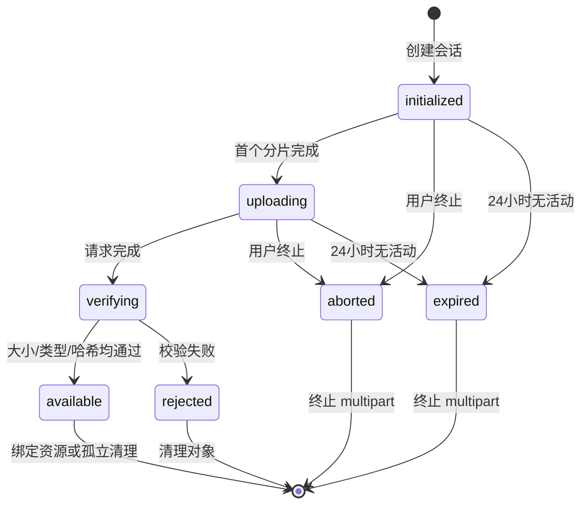

# 文件上传与存储

## 目标与边界

该模块为通知附件、个人作业和团队赛事提交提供私有对象存储。它不是通用网盘：文件必须有明确 `purpose` 和业务上下文，只有关联业务资源的授权用户可以下载。对应 FILE-001～FILE-007、SUB-001～SUB-004、SHOW-003～SHOW-005。

## 全局限制

- 单个正式提交版本的附件总量上限为 2 GiB，即 2147483648 字节。
- 单个文件不得超过版本上限；通知附件沿用同一单文件上限，但部署可配置更小值。
- 作业和赛题可设置更小的 `max_total_bytes` 与扩展名白名单，不能放宽全局规则。
- 推荐分片大小为 16 MiB，客户端并发上传 4 片；服务端每次最多签发 10 个分片 URL。
- 上传会话最后活动后 24 小时过期；分片预签名 URL 15 分钟过期；下载 URL 5 分钟过期。
- 上传完成但未绑定正式资源的对象保留 24 小时，再由 Worker 清理。

## 存储布局

MinIO 使用一个私有业务桶，生产桶名通过配置注入。对象键由服务端生成：

```text
objects/{yyyy}/{mm}/{uuid}
```

键中不出现用户邮箱、学号、原文件名、作业名或队伍名。文件名只保存在 PostgreSQL 元数据中，并在下载响应中经过安全编码作为 `Content-Disposition`。

桶策略拒绝匿名列表、读取、写入和删除。浏览器只能使用后端为具体对象、方法和过期时间生成的预签名 URL，并通过 Nginx 的 `/storage/` 同源路径访问。

## 支持目的

| `purpose` | 上下文 | 绑定目标 | 上传者 |
| --- | --- | --- | --- |
| `announcement_attachment` | 管理员通知草稿 | `announcement_files` | 管理员 |
| `assignment_submission` | 当前用户可见作业 | `version_files` | 目标学生本人 |
| `competition_submission` | 当前团队可见赛题 | `version_files` | 当前队长 |

创建会话时即验证目的、上下文、角色、作业/赛事阶段和允许类型。即使已有上传会话，完成上传和正式绑定时也要重新验证截止与权限。

## 状态机



`available` 仅表示文件可以被正式资源引用，不表示作业或赛事已提交。

## 上传流程

### 1. 初始化

客户端提交原文件名、字节数、声明媒体类型、完整 SHA-256、目的和上下文。服务端：

1. 规范化文件名并提取最后一个扩展名，拒绝双扩展绕过和控制字符。
2. 校验当前身份、业务上下文、截止、单文件大小和任务白名单。
3. 创建 `files` 与 `upload_sessions`，向 MinIO 初始化 multipart upload。
4. 返回会话 ID、16 MiB 分片大小、分片数、过期时间和已完成分片。

原文件为空文件时仍使用普通单对象上传或一个分片，但必须符合任务“至少一种提交内容”的规则。

### 2. 分片上传

- 客户端只为尚未完成的分片请求 URL，并在本地最多并发 4 片。
- 每片带 SHA-256 校验头；MinIO 校验传输内容，服务端保存分片号、ETag、校验值和大小。
- 网络失败使用带抖动的指数退避，单片最多自动重试 5 次；用户可手工继续。
- 浏览器刷新后使用 `GET /uploads/{id}` 恢复，不能信任本地记录替代服务端/MinIO状态。
- 同一分片重传覆盖旧分片；服务端以完成请求中的最终 ETag 列表为准。

### 3. 完成与校验

服务端在行锁内把会话置为 `verifying`，检查分片集合连续、数量正确、合计大小符合预期，然后调用 MinIO 完成 multipart。随后校验：

- MinIO 实际对象大小等于声明大小。
- 原扩展名在全局和任务白名单中。
- 内容探测类型与声明类型不存在危险冲突。
- 所有分片校验由 MinIO 接受，完整对象 SHA-256 与初始化值一致。

优先使用 MinIO/S3 的校验和能力核对完整对象；若目标 MinIO 版本不能提供可靠的 multipart 聚合 SHA-256，Worker 必须在对象变为 `available` 前流式读取一次计算哈希。校验过程只流式处理，不把 2 GiB 文件载入内存。

校验成功后保存 `detected_media_type`、实际大小、哈希和 `available_at`。失败则置 `rejected`，记录稳定错误码并安排清理。

### 4. 正式绑定

创建通知或提交版本时，Service 必须在同一数据库事务中：

1. 锁定被引用文件。
2. 验证文件属于当前操作者、状态为 `available`、目的和上下文匹配。
3. 验证文件尚未绑定其他正式资源。
4. 重新计算本版本附件合计，并验证当前任务上限。
5. 创建关联记录；提交版本随后不可变。

绑定失败不删除文件，允许用户在 24 小时孤立保留期内修正表单并重试。

## 文件类型策略

全局白名单以部署配置维护，首版类别包括：

- 文档：PDF、纯文本、Markdown、常见 Office 文档。
- 图片：PNG、JPEG、WebP、GIF。
- 视频：MP4、WebM。
- 压缩包：ZIP、7z、tar.gz；系统不在服务端自动解压。
- 工程与源码：由管理员明确配置的 CAD、EDA、工程归档和纯文本源码扩展名。

默认拒绝可执行程序、动态库、安装包、HTML、SVG、脚本快捷方式和未知二进制类型。文件名规范化不得改变用户下载时看到的合理名称，但授权和类型判断不依赖文件名。

首版不内置恶意软件扫描，不在线预览 Office/PDF，也不解压归档；这是部署风险记录，而不是校验通过即安全的承诺。

## 下载授权

`POST /files/{file_id}/download-url` 从文件关联反查权限：

- 通知附件：学生属于通知受众，或当前用户是管理员。
- 作业版本：当前用户是提交所有者，或管理员。
- 赛事版本：当前用户是该版本所属队伍的当前成员，或管理员。
- 优秀作业附件：源版本已被对应作业标记为优秀，且当前学生属于该作业受众，或当前用户是管理员。

授权成功返回 5 分钟 URL、显示文件名、大小、媒体类型和 SHA-256。URL 只允许 GET，不授予列桶或其他对象权限。非授权请求返回 404。

## 删除与保留

- 正式提交版本不可由学生删除。
- 被标记为优秀作业的版本所引用文件禁止删除，必须先取消优秀标记。
- 管理员合规删除需要原因，先标记文件 `deleted_at`、撤销下载，再由 Worker 删除 MinIO 对象并审计结果。
- 过期、终止、拒绝和孤立对象由 Worker 分批清理；MinIO 删除成功后更新状态，重复清理必须幂等。
- Worker 绝不依据对象桶扫描结果直接删除；必须以 PostgreSQL 状态和引用查询为准。
- 备份保留期内的对象可能仍存在于加密备份中，恢复和合规说明必须披露这一点。

## 存储容量与告警

- 部署前按“目标人数 × 平均任务数 × 平均版本数 × 平均附件量”估算一学年容量，并预留备份空间。
- MinIO 可用空间低于 20% 时告警，低于 10% 时管理员概览显示危险状态；低空间不会绕过已承诺上传，但运维必须扩容或清理孤立对象。
- 指标记录当前对象数、可用字节、24 小时上传量、失败率、孤立对象量和清理积压，不记录文件内容或原始文件名。

## Nginx 与超时

- API 初始化/完成请求体很小，Nginx 对 `/api/v1` 保持常规请求限制。
- `/storage/` 允许分片大小加少量协议开销，不接受整个 2 GiB API 请求。
- 分片上传读取超时按校内最慢允许带宽设置，默认 10 分钟；预签名本身 15 分钟过期。
- 禁止请求缓冲把整个分片写入 Nginx 临时磁盘；保留必要限速和并发连接控制。

## 故障恢复

| 故障 | 恢复行为 |
| --- | --- |
| 浏览器刷新/断网 | 查询服务端分片状态并继续未完成分片 |
| URL 过期 | 重新申请未完成分片 URL，不新建会话 |
| API 重启 | 会话在 PostgreSQL，multipart 在 MinIO，继续恢复 |
| 完成请求超时 | 使用幂等键查询会话；已完成则返回原文件 |
| MinIO 完成但数据库未更新 | 对账 Worker 查询对象并继续校验或安全清理 |
| 哈希不匹配 | 标记 `rejected`，禁止引用，提示重新上传 |
| 正式提交并发重试 | 幂等键返回同一版本，不重复绑定文件 |

## 验证场景

- 2 GiB 边界成功，超过 1 字节被拒绝；多文件合计超限被拒绝。
- 断网、刷新、分片乱序、重复分片、URL 过期和完成请求重试。
- 扩展名与内容类型不符、双扩展、控制字符文件名和哈希不匹配。
- 学生使用别人的 `file_id`、对象键或过期下载 URL。
- 报名/作业截止发生在上传过程中：允许完成对象校验，但正式提交被拒绝，随后按孤立策略清理。
- 优秀作业标记期间的删除保护、取消标记后的合规删除和 Worker 重复清理。

## 知识库媒体本地化

- Worker 或首次上线内部命令下载飞书图片、白板和附件时先执行响应大小上限；图片只接受 PNG、JPEG、GIF、WebP 魔数，附件复用全局安全扩展名、危险后缀、媒体类型和内容嗅探策略。
- 对齐参考提交 `c28f8a0` 后，图片与附件共用请求前等待 350 ms 的串行队列；白板独立请求并发送 `Accept: image/png`。已存在媒体按外部 token 复用，但对象键仍由本平台生成。
- SVG、HTML、脚本、可执行文件、双危险后缀、超限、空内容或下载失败媒体不进入 MinIO。图片或白板失败跳过对应块；附件失败显示整篇“在飞书查看”入口，页面顶部始终保留当前文档的飞书原文入口。
- 对象键使用 `knowledge/<asset_uuid>/<server_uuid>.<ext>`，全部 UUID 由服务端生成；PostgreSQL 只保存元数据、SHA-256 和引用。
- 图片/白板授权后生成 5 分钟 inline 签名，附件生成 5 分钟 attachment 签名。直接猜测资源 UUID、旧快照资源或对象键均不能通过业务授权。
- 数据库迁移降级不删除知识库对象；未来回收必须先证明没有任何成功或保留运行引用，并使用延迟、可审计清理。
