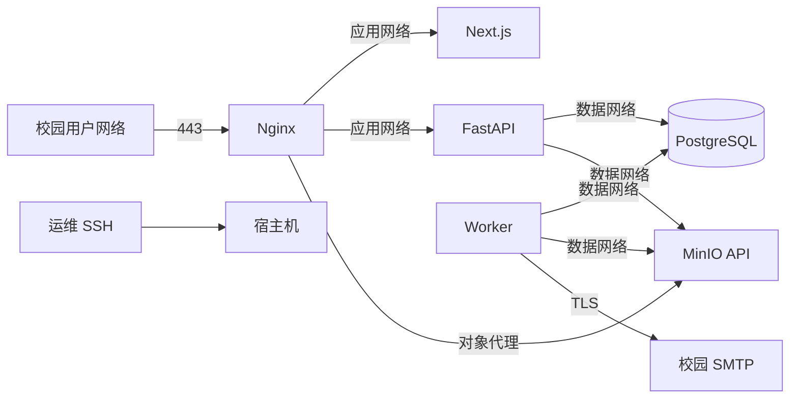

# 部署与网络

## 部署目标

首版部署在校内 Linux 服务器，通过 Docker Compose 管理 Nginx、Next.js、FastAPI、Worker、PostgreSQL 和 MinIO。系统是单节点业务部署，不宣称高可用；通过可靠持久化、备份和可恢复更新满足 NFR-001、NFR-007～NFR-009、NFR-012。

阶段 1 仓库配置默认以主机 `8080` 映射到 Nginx `8080`，仅用于本地开发和 CI 冒烟；它不是生产 HTTP 方案。局域网开发验收可以在被 Git 忽略的 `.env` 中设置 `APP_HTTP_PORT`，并同步设置 `APP_BASE_URL`、`TRUSTED_HOSTS` 和 `MINIO_PUBLIC_BASE_URL`；Compose 仍只允许 Nginx 映射主机端口。生产部署仍必须使用下述 80/443、HTTPS、证书和强密钥要求。

## 服务与端口

| 服务 | 容器端口 | 主机暴露 | 说明 |
| --- | ---: | --- | --- |
| Nginx | 80/443 | 校园用户网络 | 唯一用户入口，80 重定向 443 |
| Next.js | 3000 | 不暴露 | 仅应用网络 |
| FastAPI | 8000 | 不暴露 | 仅应用网络 |
| Worker | 无 | 不暴露 | 只主动访问依赖 |
| PostgreSQL | 5432 | 不暴露 | 仅数据网络 |
| MinIO API | 9000 | 不直接暴露 | 用户对象请求经 Nginx `/storage/` |
| MinIO Console | 9001 | 默认不暴露 | 临时运维访问需 SSH 隧道或管理网 |

## 网络拓扑



Compose 定义三个职责不同的网络：

- `app_net`：Nginx、Frontend、Backend、MinIO 对象代理路径。
- `data_net`：Backend、Worker、PostgreSQL、MinIO，设置为 internal。
- `worker_egress_net`：只连接 Worker，允许其主动访问校园 SMTP；不映射任何主机入站端口。

PostgreSQL 不加入 `app_net`。`data_net` 的 internal 属性不会阻断 Worker 的邮件发送，因为 Worker 另有独立出站网络。MinIO Console 不配置主机端口；需要时使用 SSH 隧道临时访问。

## 目录与数据卷

生产部署目录建议：

```text
/srv/pnx-training-hub/
├── compose.yml
├── env/
│   ├── app.env
│   └── secrets.env
├── nginx/
│   └── certs/
├── data/
│   ├── postgres/
│   └── minio/
├── backups/
├── state/
│   └── backup/
├── tmp/
└── logs/
```

- `data/postgres` 和 `data/minio` 使用独立持久卷或挂载点，不能位于容器可写层。
- `backups` 使用与业务数据不同的磁盘或远端加密存储；同盘副本不算有效备份。
- `state/backup` 只保存当前 MinIO 周完整基线的对象键、大小与 SHA-256 清单，必须是宿主机本地 `0700` 目录，且不得等于、位于或包含 `backups`；它不是可独立恢复的备份，不能同步到未加密的远端目标。
- `tmp` 只承载备份/恢复期间的明文临时归档，必须位于受控本地磁盘；脚本退出时清理，宿主机仍应配置重启后的临时文件清理。
- 目录仅授予对应服务账号和受控运维组访问。
- Compose 文件和非秘密配置纳入仓库；真实环境文件、证书私钥、数据、状态清单和备份不纳入 Git。

## Nginx 路由

| 路径 | 上游 | 要点 |
| --- | --- | --- |
| `/api/v1/` | FastAPI | 保留请求 ID、真实来源 IP、常规 JSON 请求限制 |
| `/health/` | FastAPI | 只暴露安全的存活/就绪结果 |
| `/storage/` | MinIO API | 仅预签名请求；关闭大分片请求缓冲 |
| `/_next/` | Next.js | 静态资源缓存和不可变指纹 |
| 其他 | Next.js | 页面与认证入口 |

- Nginx 生成或传递 `X-Request-ID`，覆盖不合法的外部值。
- `X-Forwarded-Proto`、`Host` 和真实 IP 只信任受控代理链。
- 开发与生产 Nginx 都必须用 `proxy_set_header X-Forwarded-For $remote_addr` 覆盖客户端自带转发头，Backend 不得直接暴露；持久 Session 的精确 IP HMAC 只能使用该可信值。若增加上游负载均衡，必须先明确可信代理链并重新验证伪造转发头不能改变绑定来源。
- Next.js Server Component 直连内部 Backend 时必须继续透传上述 Nginx 已覆盖的单值 `X-Forwarded-For` 与当前请求 Cookie；Frontend 不得发布宿主端口，缺失可信来源头时不得用容器地址或其他值补造。
- `/api/v1` 默认请求体限制 2 MiB；文件数据只走 `/storage/`。
- `/storage/` 单请求限制为 17 MiB，覆盖 16 MiB 分片及协议开销。
- MinIO 预签名基于内部 `minio:9000` 生成；Nginx 去除 `/storage` 前缀时必须把上游 `Host` 固定恢复为 `minio:9000`，否则 SigV4 返回 `SignatureDoesNotMatch`。
- 安全头以 `08-auth-security-email.md` 为准。

## HTTPS 与域名

- 使用校内 DNS 的稳定域名，例如 `training-hub.internal.example.edu`。
- 优先使用学校 CA 或受信任公共 CA 证书；若只能使用内部 CA，必须向所有受管终端部署根证书，不能要求用户忽略浏览器警告。
- 80 端口仅做永久重定向到 HTTPS；生产 Session Cookie 只在 HTTPS 下工作。
- 证书续期至少提前 30 天告警；替换证书后无中断重载 Nginx。

## Compose 服务

```text
nginx
frontend
backend
worker
migrate
postgres
minio
```

- `backend` 和 `worker` 使用同一个后端镜像，不同入口命令，避免代码漂移。
- `migrate` 使用相同后端镜像，是等待 PostgreSQL 健康后执行 `alembic upgrade head` 的一次性服务；Backend 与 Worker 只在迁移成功后启动。
- `depends_on` 的健康条件只用于启动顺序，应用本身必须对依赖暂不可用执行有限重试。
- 镜像使用固定版本或 digest，不使用生产 `latest`。
- 容器以非 root 用户运行，根文件系统尽量只读，只挂载必要目录。
- 后端镜像中的非秘密应用源码、迁移和 Alembic 配置必须不可写但可读/可遍历；除常驻 `appuser` 外，还要允许备份脚本以宿主降权 UID 启动一次性对象导出进程，不得靠 root 绕过源码权限。
- 设置 CPU、内存和日志轮换限制，防止单服务耗尽宿主机。

## 环境变量

### 应用

- `APP_ENV=production`
- `APP_BASE_URL`
- `APP_TIMEZONE=Asia/Shanghai`
- `TRUSTED_HOSTS`
- `CAMPUS_EMAIL_DOMAIN=connect.hkust-gz.edu.cn`，生产值必须与产品要求一致
- `SESSION_CURRENT_SECRET`、`SESSION_PREVIOUS_SECRET`
- `CSRF_SECRET`
- `SESSION_COOKIE_SECURE=true`，生产不得关闭
- `OUTBOX_ENCRYPTION_KEY`，独立 32 字节认证加密密钥
- `GLOBAL_MAX_UPLOAD_BYTES=2147483648`
- `UPLOAD_PART_SIZE_BYTES=16777216`
- `UPLOAD_SESSION_TTL_SECONDS=86400`

### PostgreSQL

- `DATABASE_HOST`、`DATABASE_PORT`、`DATABASE_NAME`
- `DATABASE_USER`、`DATABASE_PASSWORD`
- 连接池大小根据 API 和 Worker 总并发设置，不超过 PostgreSQL 安全连接数。

### MinIO

- `MINIO_INTERNAL_ENDPOINT`
- `MINIO_PUBLIC_BASE_URL`
- `MINIO_BUCKET`
- `MINIO_ACCESS_KEY`、`MINIO_SECRET_KEY`
- `MINIO_REGION`

### SMTP

- `SMTP_HOST`、`SMTP_PORT`
- `SMTP_USERNAME`、`SMTP_PASSWORD`
- `SMTP_STARTTLS=true`
- `MAIL_FROM`、`MAIL_REPLY_TO`

应用启动时验证必填项、URL、域名、密钥长度和生产安全开关，失败则退出。秘密文件权限为宿主机管理员和容器运行账号可读。

## 首次部署

1. 准备域名、证书、持久磁盘、SMTP 账号和加密备份目标。
2. 从模板生成生产环境文件并注入独立随机密钥。
3. 拉取固定镜像，启动 PostgreSQL 与 MinIO，等待健康。
4. 运行 Alembic 升级，再启动 Backend、Worker、Frontend 和 Nginx。
5. 在确认数据库不存在任何 `active` 用户后，通过公开注册页注册 `@connect.hkust-gz.edu.cn` 账号并完成邮箱验证；首个成功验证的账号在同一事务中成为受最后管理员保护的 `admin`。升级库若恰好只有一个已验证 active student，`20260825_0007` 会提升其角色并撤销旧 Session，用户需重新登录。
6. 核对 `user.initial_admin_granted` 审计事件、管理员用户页面和最后管理员保护。`python -m app.cli create-admin` 仅保留为数据库已无法通过正常注册引导时的受控恢复工具，必须在容器内交互执行、记录审批与审计，不作为正常首次部署步骤。
7. 验证 HTTPS、Connect 注册拒绝边界、注册邮件、登录、上传、Worker、审计和健康端点。
8. 执行一次备份并在隔离环境完成恢复测试后再开放用户访问。

## 健康检查与监控

- Nginx：HTTPS 响应和证书剩余有效期。
- Frontend：内部健康端点能加载运行时配置。
- Backend：`/health/live` 进程存活；`/health/ready` 配置有效且 PostgreSQL 可用。
- Worker：每分钟更新数据库心跳；超过 5 分钟未更新告警。
- PostgreSQL：连接、磁盘、慢查询、锁等待和备份成功时间。
- MinIO：可用空间、磁盘错误、对象操作失败和桶可访问性。
- Outbox：最老待处理任务超过 10 分钟或出现 `dead` 即告警。
- 应用：5xx 率、P95 延迟、登录限流、上传失败和孤立对象积压。

监控通知发送到独立运维渠道，不能只依赖本系统自身邮件。

## 日志

- Nginx、Frontend、Backend、Worker 和数据库审计使用结构化或可解析日志，并配置按大小/日期轮换。
- 对象归档路径只接受服务端生成的 `objects/` 普通上传和 `knowledge/` 知识库媒体前缀；绝对路径、少于两段、空段、`.` 或 `..` 一律拒绝，不能为兼容历史数据放宽为任意对象键。
- 容器标准输出由宿主机日志驱动限制大小，关键审计仍写 PostgreSQL。
- 日志默认保留 30 天，审计日志保留至少两个培训年度；实际期限须遵守学校数据政策。
- 日志不得包含秘密、Cookie、一次性令牌、完整邀请码、私密评语或文件内容。

## 备份

### 策略

- PostgreSQL：每日与每周均生成 `pg_dump` 自定义格式快照；保留最近 14 个每日和 8 个每周版本。
- MinIO：每周完整归档全部对象并流式计算完整清单；每日相对当前周基线生成累计增量，只携带新增/变化对象、删除集合和当日完整清单。任一每日备份只依赖一个周基线，不依赖更早的每日备份。
- 日增量通过周备份 ID 和基线清单 SHA-256 绑定。缺少本地基线状态、周加密归档、外部校验和或成功元数据时必须失败，不得静默退化为每日完整备份或无基线增量。
- 配置：备份 Compose、Nginx 非秘密配置和加密后的必要密钥材料；证书私钥按学校规范保管。
- 所有可恢复备份在离开宿主机前使用 OpenPGP 接收方加密，并写入归档 SHA-256、内部逐文件校验清单和不含个人信息的外部元数据。
- 保留脚本默认只做 dry-run；应用删除时先识别保留每日备份引用的周基线，被引用基线即使超过周数量阈值也不得删除。

### 一致性

每周完整备份在短维护窗口中暂停新提交和管理写操作，等待 Worker 完成或释放任务，然后记录数据库与 MinIO 清单时间点。每日备份允许少量孤立对象，但数据库快照与对象清单使用同一备份 ID；恢复后必须运行全量只读对账，不允许数据库引用缺失对象、大小/哈希不符或未追踪对象无告警。

### 恢复演练

1. 在隔离网络和全新 `pnx-restore-*` Compose 项目中启动相同或兼容版本的 PostgreSQL 与 MinIO，显式确认项目名；恢复脚本拒绝普通生产/开发项目名。
2. 验证目标归档外部校验和、OpenPGP 解密、内部逐文件校验和与安全路径；若目标为每日增量，再解析并验证其唯一周基线归档。
   对账必须同时覆盖普通 `files` 与 `knowledge_assets`；恢复脚本只在数据库引用无缺失、大小和 SHA-256 无差异时继续。未追踪对象以计数警告保留，不能自动删除，也不能把对象键写入部署摘要或普通日志。
3. 恢复目标日 PostgreSQL 快照；MinIO 先导入空桶周基线，再校验基线对象集合、应用新增/变化对象和删除集合，最后核对目标完整清单。周完整备份直接导入空桶。
4. 检查 Alembic head，运行只读引用对账，确认每个 `available` 文件存在且大小/哈希匹配，并报告未追踪对象而不自动删除。
5. 使用测试管理员验证登录、通知、提交版本、评语、作业内优秀作业和下载，记录实际 RPO/RTO；目标为 RPO 24 小时、RTO 4 小时。

恢复演练至少每学期一次，结果写入 `.agents/docs/18-production-operations-report.md` 和变更记录。生产命令、故障演练与外部前置材料见该报告。

## 发布与回滚

1. 在 CI 构建固定镜像并完成测试、依赖扫描和迁移测试。
2. 生产更新前备份数据库并确认 MinIO 健康。
3. 运行向后兼容迁移；数据修正导致 Session 撤销时提前通知受影响用户。迁移成功后启动新 Backend/Worker，再更新 Frontend 和 Nginx。
4. 执行冒烟测试和监控观察。
5. 应用故障时回退镜像；数据库使用迁移的前滚修复或已测试降级。禁止在未评估数据写入后直接恢复旧数据库备份。

对于破坏性结构变化，采用展开/收缩发布：先兼容旧字段，再迁移数据和应用，最后在后续版本删除旧字段。
`20260830_0016` 只增加可空 Session IP 绑定列，可先迁移数据库再发布应用。若已创建持久会话，回滚旧应用会停止校验该列并形成安全放宽；应优先前滚修复，必须回滚时先评估并撤销 `ip_binding_hash IS NOT NULL` 的活动会话，再决定是否降级删除该列。

## 容量基线

部署验收以 300 个激活账号、100 个并发浏览会话、20 个并发分片上传为基准。CPU、内存和磁盘以压力测试结果确定；对象盘至少保留预计一学年数据与本地缓冲的两倍空间，备份盘单独计算。低于 20% 可用空间告警，低于 10% 进入高优先级运维事件。

## 故障处理

| 故障 | 用户影响 | 运维动作 |
| --- | --- | --- |
| SMTP 不可用 | 站内发布正常，邮件积压 | 修复 SMTP，观察 Outbox 自动重试 |
| Worker 停止 | 邮件、定时状态和清理延迟 | 重启 Worker，确认心跳与积压下降 |
| MinIO 不可用 | 上传/下载不可用，其他读取继续 | 修复存储，禁止绕过到本地文件 |
| PostgreSQL 不可用 | 动态业务不可用 | 停止接流量，修复或按恢复流程恢复 |
| 磁盘不足 | 上传风险最高 | 暂停新上传，扩容并清理已确认孤立对象 |
| 证书过期 | 浏览器阻止访问 | 从受信 CA 更新，不允许临时关闭 HTTPS |

## 飞书知识库部署配置

- 部署方只需填写 `FEISHU_APP_ID`、`FEISHU_APP_SECRET` 和 `FEISHU_WIKI_URL`，三项必须成组配置，不再要求独立 Space ID、Root Node Token 或参考仓库的可选 `FEISHU_DOCUMENT_ID`；生产可用 `FEISHU_APP_SECRET_FILE` 替代直接 secret 值。
- `FEISHU_WIKI_URL=https://<tenant>.feishu.cn/wiki/space/<space_id>` 同步整个空间；`https://<tenant>.feishu.cn/wiki/<node_token>` 同步单篇新版文档。空间 ID 从 URL 自动解析且必须为数字。
- 旧 `FEISHU_KNOWLEDGE_SOURCE_URL` 仅作为当前 `.env` 的迁移兼容别名；新部署、示例与 Compose 统一使用 `FEISHU_WIKI_URL`。文档、媒体数量和单媒体字节上限是平台内置安全边界与可选运维调优项，不是部署方必须填写的第四项业务资料。
- 未启用同步时生产仍创建权限 0600 的空 secret 文件并将 App ID/Wiki URL 留空；不得把真实 app secret 写入 `.env.example`、镜像、Compose 文件、CI 日志或前端环境。
- 只有常驻 Worker 或基于同一 Worker 服务启动的一次性前台初始化容器连接 `worker_egress_net` 并主动访问飞书开放 API；Backend/Frontend 保持无飞书出网路径。防火墙可把该网络的 443 出站进一步限制到飞书开放 API 解析地址，并监控 DNS 变化。
- 未配置凭证时服务仍可启动、学生可读取已有快照，但管理员创建同步返回安全的未配置错误。首次真实同步已于 2026-08-27 在部署方完成权限配置后以前台接管方式验收通过；后续更新继续检查最新运行、Outbox 与学生读取状态。

首次上线需要加速时，可先停止常驻 Worker，使用内部前台初始化命令接管数据库中唯一活动运行并复用同一同步器；不得创建第二条运行或第二套 API。命令按参考提交 `c28f8a0` 完整同步目录、全部正文和媒体，成功后再恢复 Worker，使原 Outbox 幂等收敛。后续所有更新仍由真实管理员通过 `POST /admin/knowledge/sync` 创建并由 Worker 执行。

2026-08-27 的首次完整运行已以 `succeeded` 完成 228 个目录节点、212 篇文档和 977 个成功媒体引用，耗时 `00:33:28.757715`；13 次允许的资源回退未阻断快照，旧 48 篇阶段快照已被自然替代。恢复 Worker 后最新 `sync_knowledge` Outbox 为 `sent`、`attempt_count=1` 且无错误；本轮未新增数据库迁移，Alembic 保持 `20260827_0011`。
