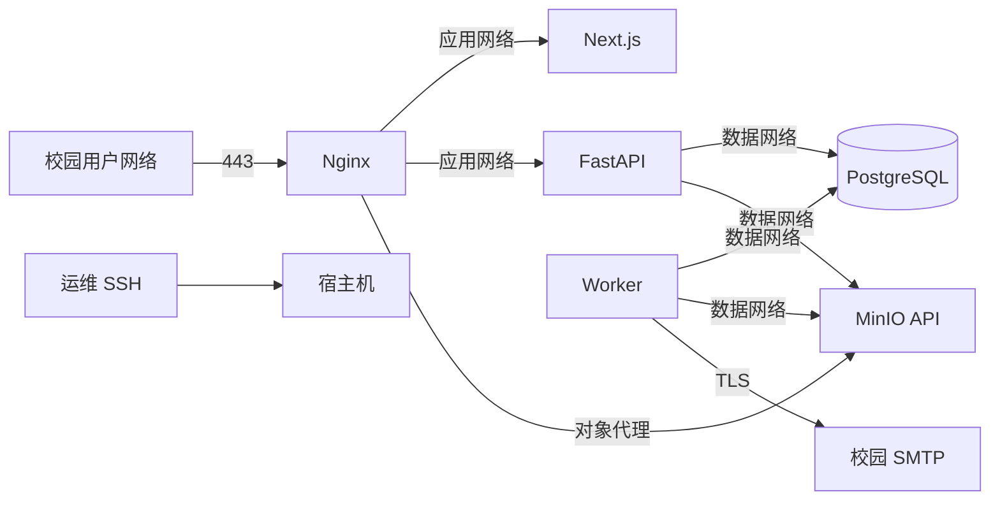

# 部署与网络

## 部署目标

首版部署在校内 Linux 服务器，通过 Docker Compose 管理 Nginx、Next.js、FastAPI、Worker、PostgreSQL 和 MinIO。系统是单节点业务部署，不宣称高可用；通过可靠持久化、备份和可恢复更新满足 NFR-001、NFR-007～NFR-009、NFR-012。

阶段 1 仓库配置以主机 `8080` 映射到 Nginx `8080`，仅用于本地开发和 CI 冒烟；它不是生产 HTTP 方案。生产部署仍必须使用下述 80/443、HTTPS、证书和强密钥要求。

## 服务与端口

| 服务 | 容器端口 | 主机暴露 | 说明 |
| --- | ---: | --- | --- |
| Nginx | 80/443 | 校园用户网络 | 唯一用户入口，80 重定向 443 |
| Next.js | 3000 | 不暴露 | 仅应用网络 |
| FastAPI | 8000 | 不暴露 | 仅应用网络 |
| Worker | 无 | 不暴露 | 只主动访问依赖 |
| PostgreSQL | 5432 | 不暴露 | 仅数据网络 |
| MinIO API | 9000 | 不直接暴露 | 用户对象请求经 Nginx `/storage/` |
| MinIO Console | 9001 | 默认不暴露 | 临时运维访问需 SSH 隧道或管理网 |

## 网络拓扑



Compose 定义三个职责不同的网络：

- `app_net`：Nginx、Frontend、Backend、MinIO 对象代理路径。
- `data_net`：Backend、Worker、PostgreSQL、MinIO，设置为 internal。
- `worker_egress_net`：只连接 Worker，允许其主动访问校园 SMTP；不映射任何主机入站端口。

PostgreSQL 不加入 `app_net`。`data_net` 的 internal 属性不会阻断 Worker 的邮件发送，因为 Worker 另有独立出站网络。MinIO Console 不配置主机端口；需要时使用 SSH 隧道临时访问。

## 目录与数据卷

生产部署目录建议：

```text
/srv/pnx-training-hub/
├── compose.yml
├── env/
│   ├── app.env
│   └── secrets.env
├── nginx/
│   └── certs/
├── data/
│   ├── postgres/
│   └── minio/
├── backups/
└── logs/
```

- `data/postgres` 和 `data/minio` 使用独立持久卷或挂载点，不能位于容器可写层。
- `backups` 使用与业务数据不同的磁盘或远端加密存储；同盘副本不算有效备份。
- 目录仅授予对应服务账号和受控运维组访问。
- Compose 文件和非秘密配置纳入仓库；真实环境文件、证书私钥、数据和备份不纳入 Git。

## Nginx 路由

| 路径 | 上游 | 要点 |
| --- | --- | --- |
| `/api/v1/` | FastAPI | 保留请求 ID、真实来源 IP、常规 JSON 请求限制 |
| `/health/` | FastAPI | 只暴露安全的存活/就绪结果 |
| `/storage/` | MinIO API | 仅预签名请求；关闭大分片请求缓冲 |
| `/_next/` | Next.js | 静态资源缓存和不可变指纹 |
| 其他 | Next.js | 页面与认证入口 |

- Nginx 生成或传递 `X-Request-ID`，覆盖不合法的外部值。
- `X-Forwarded-Proto`、`Host` 和真实 IP 只信任受控代理链。
- `/api/v1` 默认请求体限制 2 MiB；文件数据只走 `/storage/`。
- `/storage/` 单请求限制为 17 MiB，覆盖 16 MiB 分片及协议开销。
- 安全头以 `08-auth-security-email.md` 为准。

## HTTPS 与域名

- 使用校内 DNS 的稳定域名，例如 `training-hub.internal.example.edu`。
- 优先使用学校 CA 或受信任公共 CA 证书；若只能使用内部 CA，必须向所有受管终端部署根证书，不能要求用户忽略浏览器警告。
- 80 端口仅做永久重定向到 HTTPS；生产 Session Cookie 只在 HTTPS 下工作。
- 证书续期至少提前 30 天告警；替换证书后无中断重载 Nginx。

## Compose 服务

```text
nginx
frontend
backend
worker
migrate
postgres
minio
```

- `backend` 和 `worker` 使用同一个后端镜像，不同入口命令，避免代码漂移。
- `migrate` 使用相同后端镜像，是等待 PostgreSQL 健康后执行 `alembic upgrade head` 的一次性服务；Backend 与 Worker 只在迁移成功后启动。
- `depends_on` 的健康条件只用于启动顺序，应用本身必须对依赖暂不可用执行有限重试。
- 镜像使用固定版本或 digest，不使用生产 `latest`。
- 容器以非 root 用户运行，根文件系统尽量只读，只挂载必要目录。
- 设置 CPU、内存和日志轮换限制，防止单服务耗尽宿主机。

## 环境变量

### 应用

- `APP_ENV=production`
- `APP_BASE_URL`
- `APP_TIMEZONE=Asia/Shanghai`
- `TRUSTED_HOSTS`
- `CAMPUS_EMAIL_DOMAIN=hkust-gz.edu.cn`，生产值必须与产品要求一致
- `SESSION_CURRENT_SECRET`、`SESSION_PREVIOUS_SECRET`
- `CSRF_SECRET`
- `GLOBAL_MAX_UPLOAD_BYTES=2147483648`
- `UPLOAD_PART_SIZE_BYTES=16777216`
- `UPLOAD_SESSION_TTL_SECONDS=86400`

### PostgreSQL

- `DATABASE_HOST`、`DATABASE_PORT`、`DATABASE_NAME`
- `DATABASE_USER`、`DATABASE_PASSWORD`
- 连接池大小根据 API 和 Worker 总并发设置，不超过 PostgreSQL 安全连接数。

### MinIO

- `MINIO_INTERNAL_ENDPOINT`
- `MINIO_PUBLIC_BASE_URL`
- `MINIO_BUCKET`
- `MINIO_ACCESS_KEY`、`MINIO_SECRET_KEY`
- `MINIO_REGION`

### SMTP

- `SMTP_HOST`、`SMTP_PORT`
- `SMTP_USERNAME`、`SMTP_PASSWORD`
- `SMTP_STARTTLS=true`
- `MAIL_FROM`、`MAIL_REPLY_TO`

应用启动时验证必填项、URL、域名、密钥长度和生产安全开关，失败则退出。秘密文件权限为宿主机管理员和容器运行账号可读。

## 首次部署

1. 准备域名、证书、持久磁盘、SMTP 账号和加密备份目标。
2. 从模板生成生产环境文件并注入独立随机密钥。
3. 拉取固定镜像，启动 PostgreSQL 与 MinIO，等待健康。
4. 运行 Alembic 升级，再启动 Backend、Worker、Frontend 和 Nginx。
5. 使用目标管理命令创建首个管理员：

   ```bash
   docker compose exec backend python -m app.cli create-admin
   ```

   命令交互读取校园邮箱和密码，不在命令行参数或 shell 历史中暴露密码。

6. 验证 HTTPS、注册邮件、登录、上传、Worker、审计和健康端点。
7. 执行一次备份并在隔离环境完成恢复测试后再开放用户访问。

## 健康检查与监控

- Nginx：HTTPS 响应和证书剩余有效期。
- Frontend：内部健康端点能加载运行时配置。
- Backend：`/health/live` 进程存活；`/health/ready` 配置有效且 PostgreSQL 可用。
- Worker：每分钟更新数据库心跳；超过 5 分钟未更新告警。
- PostgreSQL：连接、磁盘、慢查询、锁等待和备份成功时间。
- MinIO：可用空间、磁盘错误、对象操作失败和桶可访问性。
- Outbox：最老待处理任务超过 10 分钟或出现 `dead` 即告警。
- 应用：5xx 率、P95 延迟、登录限流、上传失败和孤立对象积压。

监控通知发送到独立运维渠道，不能只依赖本系统自身邮件。

## 日志

- Nginx、Frontend、Backend、Worker 和数据库审计使用结构化或可解析日志，并配置按大小/日期轮换。
- 容器标准输出由宿主机日志驱动限制大小，关键审计仍写 PostgreSQL。
- 日志默认保留 30 天，审计日志保留至少两个培训年度；实际期限须遵守学校数据政策。
- 日志不得包含秘密、Cookie、一次性令牌、完整邀请码、私密评语或文件内容。

## 备份

### 策略

- PostgreSQL：每日 `pg_dump` 自定义格式，每周完整备份；保留最近 14 个每日和 8 个每周版本。
- MinIO：每日对新增/变化对象做增量镜像，每周执行完整校验清单；版本必须与数据库备份时间戳关联。
- 配置：备份 Compose、Nginx 非秘密配置和加密后的必要密钥材料；证书私钥按学校规范保管。
- 所有备份在离开宿主机前加密，并写入校验和与清单。

### 一致性

每周完整备份在短维护窗口中暂停新提交和管理写操作，等待 Worker 完成或释放任务，然后记录数据库与 MinIO 清单时间点。每日备份允许少量孤立对象，恢复后由对账 Worker识别，不允许出现数据库引用缺失对象而无告警。

### 恢复演练

1. 在隔离网络启动相同或兼容版本的 PostgreSQL 与 MinIO。
2. 验证备份校验和，恢复对象和数据库。
3. 运行迁移状态检查与引用对账，确认每个 `available` 文件存在且大小/哈希匹配。
4. 使用测试管理员验证登录、通知、提交版本、评语、作业内优秀作业和下载。
5. 记录实际 RPO/RTO；目标为 RPO 24 小时、RTO 4 小时。

恢复演练至少每学期一次，结果写入 `.agents/docs/16-changelog.md` 或正式运维记录。

## 发布与回滚

1. 在 CI 构建固定镜像并完成测试、依赖扫描和迁移测试。
2. 生产更新前备份数据库并确认 MinIO 健康。
3. 运行向后兼容迁移，启动新 Backend/Worker，再更新 Frontend 和 Nginx。
4. 执行冒烟测试和监控观察。
5. 应用故障时回退镜像；数据库使用迁移的前滚修复或已测试降级。禁止在未评估数据写入后直接恢复旧数据库备份。

对于破坏性结构变化，采用展开/收缩发布：先兼容旧字段，再迁移数据和应用，最后在后续版本删除旧字段。

## 容量基线

部署验收以 300 个激活账号、100 个并发浏览会话、20 个并发分片上传为基准。CPU、内存和磁盘以压力测试结果确定；对象盘至少保留预计一学年数据与本地缓冲的两倍空间，备份盘单独计算。低于 20% 可用空间告警，低于 10% 进入高优先级运维事件。

## 故障处理

| 故障 | 用户影响 | 运维动作 |
| --- | --- | --- |
| SMTP 不可用 | 站内发布正常，邮件积压 | 修复 SMTP，观察 Outbox 自动重试 |
| Worker 停止 | 邮件、定时状态和清理延迟 | 重启 Worker，确认心跳与积压下降 |
| MinIO 不可用 | 上传/下载不可用，其他读取继续 | 修复存储，禁止绕过到本地文件 |
| PostgreSQL 不可用 | 动态业务不可用 | 停止接流量，修复或按恢复流程恢复 |
| 磁盘不足 | 上传风险最高 | 暂停新上传，扩容并清理已确认孤立对象 |
| 证书过期 | 浏览器阻止访问 | 从受信 CA 更新，不允许临时关闭 HTTPS |
